Assignment 3 - Exploring causal inference issues
------------------------------------------------

In this assignment we explore some issues related to multiple regressions (regressions with more than one predictor), and inferred (causal) relations between variables. N.B. the data is simulated (to make sure I know the actual mechanism generating it), but it's based on a real study. So bear with a longish introduction to get into the details of what we are doing and why it is important.

### Altercentric intrusion in schizophrenia

People with schizophrenia often report altered control and distinction of self-other representations: intrusive thoughts, hearing of voices, delusions of mind reading, paranoia, etc (a substantial portion of the psychotic symptoms experienced in schizophrenia). These have been variously attributed to hypermentalizing (over attribution of mental states to others), social impairment (over preoccupation with own thought processes), hyper socialization (inability to inhibit information from others), etc.

The current study investigates 1) whether schizophrenia is indeed related to altered control and distinction of self-other representations, in particular altercentric intrusions (inability to inhibit social information), and 2) whether these are related to the relevant psychotic symptoms. N.B. the actual study also investigates egocentric intrusion, do check the papers below if interested.

The task is a slightly modified version of this: <https://www.ncbi.nlm.nih.gov/pubmed/20731512> You look at a picture with some dots visible to you, as well as with a different person with a different set of dots visible to them. The number of dots you see and that the other sees can be the same (congruent condition) or not (incongruent condition). You are tasked to indicate whether a given number (e.g. 3) matches the number of dots you see (and the dots visible to the other person are irrelevant to the task).

The tasks investigates altercentric intrusion: will your reaction time change according to whether the other person is seeing the same amount of dots as you, or not? The idea is that if you correctly inhibit social information, your reaction time should not change, as the information about the other person is not relevant. On the contrary, if you nevertheless use task irrelevant social information, you'll be slower at indicating whether 3 is the right number of dots when the other person sees a different amount of dots than you (conflicting information). The bigger the difference between RTs in the congruent and incongruent condition the bigger the altercentric intrusion effect.

For each participant you have 6 variables: 1) ID, 2) AltercentricIntrusion (continuous score), 3) Diagnosis (schizophrenia vs. control), 4) VoiceHearing (severity of voice hearing symptoms, continuous score of the severity of the symptom as measured by a clinician), 5) MindReading (severity of delusions of mind reading, continuous score of the severity of the symptom as measured by a clinician); 6) Apathy (severity of lack of motivation in taking care of oneself, from washing to showing up at work, continuous score of the severity of the symptom as measured by a clinician).

The research questions you have to answer are the following:

First part
----------

Q1.1) Does schizophrenia involved altercentric intrusion? Define model and priors. Test the implications of your priors (prior predictive checks) and if needed adjust them. Run the model. Test the quality of the fitted model (posterior predictive checks). Assess the evidence in favor of an increased altercentric intrusion in schizophrenia. Report the model and the results, including plots.

``` r
pacman::p_load(tidyverse, brms)

# Prepare the data

d <- read_csv('Ass3.csv')
```

    ## Parsed with column specification:
    ## cols(
    ##   VoiceHearing = col_double(),
    ##   MindReading = col_double(),
    ##   Apathy = col_double(),
    ##   AltercentricIntrusion = col_double(),
    ##   ID = col_double(),
    ##   Diagnosis = col_double()
    ## )

``` r
#summary(d)

d$Diagnosis <- plyr::revalue(as.character(d$Diagnosis), 
                             c("0"="Controls", "1"="Schizophrenia"))

d <- d %>%
  mutate(
    ID = as.factor(ID),
    Diagnosis = as.factor(Diagnosis)
  )

# Define the formula

AltercentricDiagnosis_f0 <- bf(
  AltercentricIntrusion ~ 1 + Diagnosis
)

AltercentricDiagnosis_f <- bf(
  AltercentricIntrusion ~ 0 + Diagnosis
)

# Design the priors

get_prior(AltercentricDiagnosis_f0, family = gaussian, d)
```

    ##                 prior     class                   coef group resp dpar nlpar
    ## 1                             b                                             
    ## 2                             b DiagnosisSchizophrenia                      
    ## 3 student_t(3, 4, 10) Intercept                                             
    ## 4 student_t(3, 0, 10)     sigma                                             
    ##   bound
    ## 1      
    ## 2      
    ## 3      
    ## 4

``` r
get_prior(AltercentricDiagnosis_f, family = gaussian, d)
```

    ##                 prior class                   coef group resp dpar nlpar bound
    ## 1                         b                                                   
    ## 2                         b      DiagnosisControls                            
    ## 3                         b DiagnosisSchizophrenia                            
    ## 4 student_t(3, 0, 10) sigma

``` r
priorDiagnosis <- c(
  prior(normal(4, 1), class = b), # for beta
  prior(normal(1, 2), class = sigma) # for uncertinty
) 

summary(d$AltercentricIntrusion)
```

    ##    Min. 1st Qu.  Median    Mean 3rd Qu.    Max. 
    ##   1.494   3.322   4.046   3.952   4.611   6.312

``` r
# Test the priors

AltercentricDiagnosis_PriorCheck_m <- brm(
  formula = AltercentricDiagnosis_f,
  data = d,
  family = gaussian,
  prior = priorDiagnosis,
  sample_prior = "only"
)
```

    ## Compiling the C++ model

    ## Start sampling

    ## 
    ## SAMPLING FOR MODEL 'd0917816cb7104a015f1eef055c12f98' NOW (CHAIN 1).
    ## Chain 1: 
    ## Chain 1: Gradient evaluation took 0 seconds
    ## Chain 1: 1000 transitions using 10 leapfrog steps per transition would take 0 seconds.
    ## Chain 1: Adjust your expectations accordingly!
    ## Chain 1: 
    ## Chain 1: 
    ## Chain 1: Iteration:    1 / 2000 [  0%]  (Warmup)
    ## Chain 1: Iteration:  200 / 2000 [ 10%]  (Warmup)
    ## Chain 1: Iteration:  400 / 2000 [ 20%]  (Warmup)
    ## Chain 1: Iteration:  600 / 2000 [ 30%]  (Warmup)
    ## Chain 1: Iteration:  800 / 2000 [ 40%]  (Warmup)
    ## Chain 1: Iteration: 1000 / 2000 [ 50%]  (Warmup)
    ## Chain 1: Iteration: 1001 / 2000 [ 50%]  (Sampling)
    ## Chain 1: Iteration: 1200 / 2000 [ 60%]  (Sampling)
    ## Chain 1: Iteration: 1400 / 2000 [ 70%]  (Sampling)
    ## Chain 1: Iteration: 1600 / 2000 [ 80%]  (Sampling)
    ## Chain 1: Iteration: 1800 / 2000 [ 90%]  (Sampling)
    ## Chain 1: Iteration: 2000 / 2000 [100%]  (Sampling)
    ## Chain 1: 
    ## Chain 1:  Elapsed Time: 0.042 seconds (Warm-up)
    ## Chain 1:                0.032 seconds (Sampling)
    ## Chain 1:                0.074 seconds (Total)
    ## Chain 1: 
    ## 
    ## SAMPLING FOR MODEL 'd0917816cb7104a015f1eef055c12f98' NOW (CHAIN 2).
    ## Chain 2: 
    ## Chain 2: Gradient evaluation took 0 seconds
    ## Chain 2: 1000 transitions using 10 leapfrog steps per transition would take 0 seconds.
    ## Chain 2: Adjust your expectations accordingly!
    ## Chain 2: 
    ## Chain 2: 
    ## Chain 2: Iteration:    1 / 2000 [  0%]  (Warmup)
    ## Chain 2: Iteration:  200 / 2000 [ 10%]  (Warmup)
    ## Chain 2: Iteration:  400 / 2000 [ 20%]  (Warmup)
    ## Chain 2: Iteration:  600 / 2000 [ 30%]  (Warmup)
    ## Chain 2: Iteration:  800 / 2000 [ 40%]  (Warmup)
    ## Chain 2: Iteration: 1000 / 2000 [ 50%]  (Warmup)
    ## Chain 2: Iteration: 1001 / 2000 [ 50%]  (Sampling)
    ## Chain 2: Iteration: 1200 / 2000 [ 60%]  (Sampling)
    ## Chain 2: Iteration: 1400 / 2000 [ 70%]  (Sampling)
    ## Chain 2: Iteration: 1600 / 2000 [ 80%]  (Sampling)
    ## Chain 2: Iteration: 1800 / 2000 [ 90%]  (Sampling)
    ## Chain 2: Iteration: 2000 / 2000 [100%]  (Sampling)
    ## Chain 2: 
    ## Chain 2:  Elapsed Time: 0.036 seconds (Warm-up)
    ## Chain 2:                0.043 seconds (Sampling)
    ## Chain 2:                0.079 seconds (Total)
    ## Chain 2: 
    ## 
    ## SAMPLING FOR MODEL 'd0917816cb7104a015f1eef055c12f98' NOW (CHAIN 3).
    ## Chain 3: 
    ## Chain 3: Gradient evaluation took 0 seconds
    ## Chain 3: 1000 transitions using 10 leapfrog steps per transition would take 0 seconds.
    ## Chain 3: Adjust your expectations accordingly!
    ## Chain 3: 
    ## Chain 3: 
    ## Chain 3: Iteration:    1 / 2000 [  0%]  (Warmup)
    ## Chain 3: Iteration:  200 / 2000 [ 10%]  (Warmup)
    ## Chain 3: Iteration:  400 / 2000 [ 20%]  (Warmup)
    ## Chain 3: Iteration:  600 / 2000 [ 30%]  (Warmup)
    ## Chain 3: Iteration:  800 / 2000 [ 40%]  (Warmup)
    ## Chain 3: Iteration: 1000 / 2000 [ 50%]  (Warmup)
    ## Chain 3: Iteration: 1001 / 2000 [ 50%]  (Sampling)
    ## Chain 3: Iteration: 1200 / 2000 [ 60%]  (Sampling)
    ## Chain 3: Iteration: 1400 / 2000 [ 70%]  (Sampling)
    ## Chain 3: Iteration: 1600 / 2000 [ 80%]  (Sampling)
    ## Chain 3: Iteration: 1800 / 2000 [ 90%]  (Sampling)
    ## Chain 3: Iteration: 2000 / 2000 [100%]  (Sampling)
    ## Chain 3: 
    ## Chain 3:  Elapsed Time: 0.037 seconds (Warm-up)
    ## Chain 3:                0.033 seconds (Sampling)
    ## Chain 3:                0.07 seconds (Total)
    ## Chain 3: 
    ## 
    ## SAMPLING FOR MODEL 'd0917816cb7104a015f1eef055c12f98' NOW (CHAIN 4).
    ## Chain 4: 
    ## Chain 4: Gradient evaluation took 0 seconds
    ## Chain 4: 1000 transitions using 10 leapfrog steps per transition would take 0 seconds.
    ## Chain 4: Adjust your expectations accordingly!
    ## Chain 4: 
    ## Chain 4: 
    ## Chain 4: Iteration:    1 / 2000 [  0%]  (Warmup)
    ## Chain 4: Iteration:  200 / 2000 [ 10%]  (Warmup)
    ## Chain 4: Iteration:  400 / 2000 [ 20%]  (Warmup)
    ## Chain 4: Iteration:  600 / 2000 [ 30%]  (Warmup)
    ## Chain 4: Iteration:  800 / 2000 [ 40%]  (Warmup)
    ## Chain 4: Iteration: 1000 / 2000 [ 50%]  (Warmup)
    ## Chain 4: Iteration: 1001 / 2000 [ 50%]  (Sampling)
    ## Chain 4: Iteration: 1200 / 2000 [ 60%]  (Sampling)
    ## Chain 4: Iteration: 1400 / 2000 [ 70%]  (Sampling)
    ## Chain 4: Iteration: 1600 / 2000 [ 80%]  (Sampling)
    ## Chain 4: Iteration: 1800 / 2000 [ 90%]  (Sampling)
    ## Chain 4: Iteration: 2000 / 2000 [100%]  (Sampling)
    ## Chain 4: 
    ## Chain 4:  Elapsed Time: 0.035 seconds (Warm-up)
    ## Chain 4:                0.028 seconds (Sampling)
    ## Chain 4:                0.063 seconds (Total)
    ## Chain 4:

    ## Warning: There were 1 divergent transitions after warmup. Increasing adapt_delta above 0.8 may help. See
    ## http://mc-stan.org/misc/warnings.html#divergent-transitions-after-warmup

    ## Warning: Examine the pairs() plot to diagnose sampling problems

``` r
pp_check(AltercentricDiagnosis_PriorCheck_m, nsamples = 100)
```

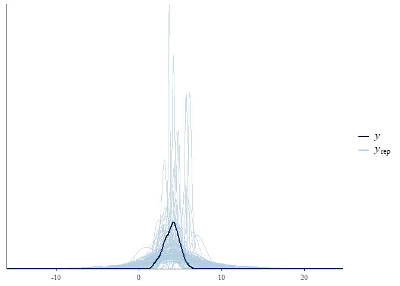

``` r
## Fitting the model
AltercentricDiagnosis_m <- brm(
  formula = AltercentricDiagnosis_f,
  data = d,
  family = gaussian,
  prior = priorDiagnosis,
  sample_prior = T
)
```

    ## Compiling the C++ model
    ## Start sampling

    ## 
    ## SAMPLING FOR MODEL 'e5ec6d4a3b5cd0936a40c60d1cfc6754' NOW (CHAIN 1).
    ## Chain 1: 
    ## Chain 1: Gradient evaluation took 0 seconds
    ## Chain 1: 1000 transitions using 10 leapfrog steps per transition would take 0 seconds.
    ## Chain 1: Adjust your expectations accordingly!
    ## Chain 1: 
    ## Chain 1: 
    ## Chain 1: Iteration:    1 / 2000 [  0%]  (Warmup)
    ## Chain 1: Iteration:  200 / 2000 [ 10%]  (Warmup)
    ## Chain 1: Iteration:  400 / 2000 [ 20%]  (Warmup)
    ## Chain 1: Iteration:  600 / 2000 [ 30%]  (Warmup)
    ## Chain 1: Iteration:  800 / 2000 [ 40%]  (Warmup)
    ## Chain 1: Iteration: 1000 / 2000 [ 50%]  (Warmup)
    ## Chain 1: Iteration: 1001 / 2000 [ 50%]  (Sampling)
    ## Chain 1: Iteration: 1200 / 2000 [ 60%]  (Sampling)
    ## Chain 1: Iteration: 1400 / 2000 [ 70%]  (Sampling)
    ## Chain 1: Iteration: 1600 / 2000 [ 80%]  (Sampling)
    ## Chain 1: Iteration: 1800 / 2000 [ 90%]  (Sampling)
    ## Chain 1: Iteration: 2000 / 2000 [100%]  (Sampling)
    ## Chain 1: 
    ## Chain 1:  Elapsed Time: 0.04 seconds (Warm-up)
    ## Chain 1:                0.038 seconds (Sampling)
    ## Chain 1:                0.078 seconds (Total)
    ## Chain 1: 
    ## 
    ## SAMPLING FOR MODEL 'e5ec6d4a3b5cd0936a40c60d1cfc6754' NOW (CHAIN 2).
    ## Chain 2: 
    ## Chain 2: Gradient evaluation took 0 seconds
    ## Chain 2: 1000 transitions using 10 leapfrog steps per transition would take 0 seconds.
    ## Chain 2: Adjust your expectations accordingly!
    ## Chain 2: 
    ## Chain 2: 
    ## Chain 2: Iteration:    1 / 2000 [  0%]  (Warmup)
    ## Chain 2: Iteration:  200 / 2000 [ 10%]  (Warmup)
    ## Chain 2: Iteration:  400 / 2000 [ 20%]  (Warmup)
    ## Chain 2: Iteration:  600 / 2000 [ 30%]  (Warmup)
    ## Chain 2: Iteration:  800 / 2000 [ 40%]  (Warmup)
    ## Chain 2: Iteration: 1000 / 2000 [ 50%]  (Warmup)
    ## Chain 2: Iteration: 1001 / 2000 [ 50%]  (Sampling)
    ## Chain 2: Iteration: 1200 / 2000 [ 60%]  (Sampling)
    ## Chain 2: Iteration: 1400 / 2000 [ 70%]  (Sampling)
    ## Chain 2: Iteration: 1600 / 2000 [ 80%]  (Sampling)
    ## Chain 2: Iteration: 1800 / 2000 [ 90%]  (Sampling)
    ## Chain 2: Iteration: 2000 / 2000 [100%]  (Sampling)
    ## Chain 2: 
    ## Chain 2:  Elapsed Time: 0.049 seconds (Warm-up)
    ## Chain 2:                0.038 seconds (Sampling)
    ## Chain 2:                0.087 seconds (Total)
    ## Chain 2: 
    ## 
    ## SAMPLING FOR MODEL 'e5ec6d4a3b5cd0936a40c60d1cfc6754' NOW (CHAIN 3).
    ## Chain 3: 
    ## Chain 3: Gradient evaluation took 0 seconds
    ## Chain 3: 1000 transitions using 10 leapfrog steps per transition would take 0 seconds.
    ## Chain 3: Adjust your expectations accordingly!
    ## Chain 3: 
    ## Chain 3: 
    ## Chain 3: Iteration:    1 / 2000 [  0%]  (Warmup)
    ## Chain 3: Iteration:  200 / 2000 [ 10%]  (Warmup)
    ## Chain 3: Iteration:  400 / 2000 [ 20%]  (Warmup)
    ## Chain 3: Iteration:  600 / 2000 [ 30%]  (Warmup)
    ## Chain 3: Iteration:  800 / 2000 [ 40%]  (Warmup)
    ## Chain 3: Iteration: 1000 / 2000 [ 50%]  (Warmup)
    ## Chain 3: Iteration: 1001 / 2000 [ 50%]  (Sampling)
    ## Chain 3: Iteration: 1200 / 2000 [ 60%]  (Sampling)
    ## Chain 3: Iteration: 1400 / 2000 [ 70%]  (Sampling)
    ## Chain 3: Iteration: 1600 / 2000 [ 80%]  (Sampling)
    ## Chain 3: Iteration: 1800 / 2000 [ 90%]  (Sampling)
    ## Chain 3: Iteration: 2000 / 2000 [100%]  (Sampling)
    ## Chain 3: 
    ## Chain 3:  Elapsed Time: 0.039 seconds (Warm-up)
    ## Chain 3:                0.042 seconds (Sampling)
    ## Chain 3:                0.081 seconds (Total)
    ## Chain 3: 
    ## 
    ## SAMPLING FOR MODEL 'e5ec6d4a3b5cd0936a40c60d1cfc6754' NOW (CHAIN 4).
    ## Chain 4: 
    ## Chain 4: Gradient evaluation took 0 seconds
    ## Chain 4: 1000 transitions using 10 leapfrog steps per transition would take 0 seconds.
    ## Chain 4: Adjust your expectations accordingly!
    ## Chain 4: 
    ## Chain 4: 
    ## Chain 4: Iteration:    1 / 2000 [  0%]  (Warmup)
    ## Chain 4: Iteration:  200 / 2000 [ 10%]  (Warmup)
    ## Chain 4: Iteration:  400 / 2000 [ 20%]  (Warmup)
    ## Chain 4: Iteration:  600 / 2000 [ 30%]  (Warmup)
    ## Chain 4: Iteration:  800 / 2000 [ 40%]  (Warmup)
    ## Chain 4: Iteration: 1000 / 2000 [ 50%]  (Warmup)
    ## Chain 4: Iteration: 1001 / 2000 [ 50%]  (Sampling)
    ## Chain 4: Iteration: 1200 / 2000 [ 60%]  (Sampling)
    ## Chain 4: Iteration: 1400 / 2000 [ 70%]  (Sampling)
    ## Chain 4: Iteration: 1600 / 2000 [ 80%]  (Sampling)
    ## Chain 4: Iteration: 1800 / 2000 [ 90%]  (Sampling)
    ## Chain 4: Iteration: 2000 / 2000 [100%]  (Sampling)
    ## Chain 4: 
    ## Chain 4:  Elapsed Time: 0.04 seconds (Warm-up)
    ## Chain 4:                0.035 seconds (Sampling)
    ## Chain 4:                0.075 seconds (Total)
    ## Chain 4:

``` r
# Posterior predictive check
pp_check(AltercentricDiagnosis_m, nsamples = 100)
```

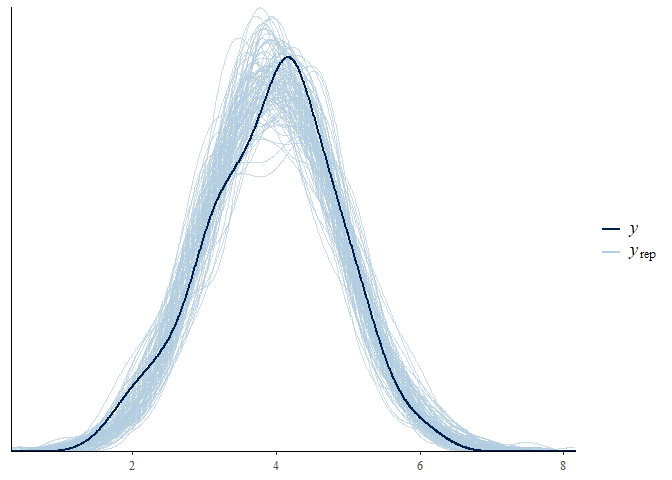

``` r
## Check the model for warnings
AltercentricDiagnosis_m
```

    ##  Family: gaussian 
    ##   Links: mu = identity; sigma = identity 
    ## Formula: AltercentricIntrusion ~ 0 + Diagnosis 
    ##    Data: d (Number of observations: 300) 
    ## Samples: 4 chains, each with iter = 2000; warmup = 1000; thin = 1;
    ##          total post-warmup samples = 4000
    ## 
    ## Population-Level Effects: 
    ##                        Estimate Est.Error l-95% CI u-95% CI Rhat Bulk_ESS
    ## DiagnosisControls          3.86      0.06     3.74     3.98 1.00     4397
    ## DiagnosisSchizophrenia     4.22      0.10     4.02     4.43 1.00     3639
    ##                        Tail_ESS
    ## DiagnosisControls          2772
    ## DiagnosisSchizophrenia     2724
    ## 
    ## Family Specific Parameters: 
    ##       Estimate Est.Error l-95% CI u-95% CI Rhat Bulk_ESS Tail_ESS
    ## sigma     0.92      0.04     0.85     0.99 1.00     4633     2976
    ## 
    ## Samples were drawn using sampling(NUTS). For each parameter, Bulk_ESS
    ## and Tail_ESS are effective sample size measures, and Rhat is the potential
    ## scale reduction factor on split chains (at convergence, Rhat = 1).

``` r
# Hypothesis testing + updating check
plot(hypothesis(AltercentricDiagnosis_m,
           "DiagnosisSchizophrenia > DiagnosisControls"))
```

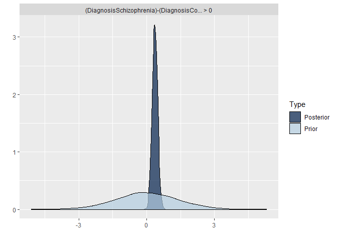

``` r
hypothesis(AltercentricDiagnosis_m,
           "DiagnosisSchizophrenia > DiagnosisControls")
```

    ## Hypothesis Tests for class b:
    ##                 Hypothesis Estimate Est.Error CI.Lower CI.Upper Evid.Ratio
    ## 1 (DiagnosisSchizop... > 0     0.36      0.12     0.17     0.56        799
    ##   Post.Prob Star
    ## 1         1    *
    ## ---
    ## 'CI': 90%-CI for one-sided and 95%-CI for two-sided hypotheses.
    ## '*': For one-sided hypotheses, the posterior probability exceeds 95%;
    ## for two-sided hypotheses, the value tested against lies outside the 95%-CI.
    ## Posterior probabilities of point hypotheses assume equal prior probabilities.

``` r
conditional_effects(AltercentricDiagnosis_m)
```

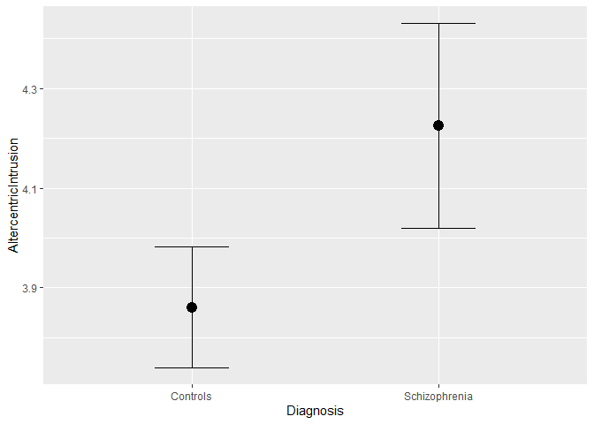

``` r
plot(conditional_effects(AltercentricDiagnosis_m), points=T)
```

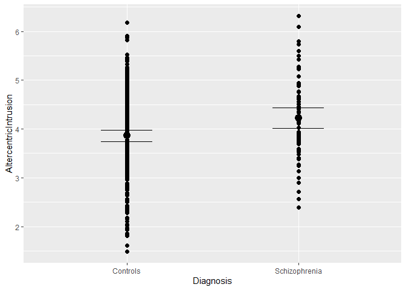

``` r
 # If you only have one person, you don't have a high predictorbility of diagnosis - however, the two groups are very different.
```

The model indicates a credible difference in altercentric intrusion in the two groups supporting our hypothesis (b = 0.36, CIs = 0.16, 0.57, ER = 1332). Controls showed on average an altercentric intrusion effect of 3.86 (CIs 3.74, 3.98), and schizophrenia of 4.22 (CIs = 4.01, 4.43). \[Add plot of the effects\]

SI
==

The model had no divergences, a Rhat of 1, and Effective Sample Sizes above 2000 for both Bulk and Tail. \[Add prior and posterior checks plots; add updating check plot\]

Q1.2) Is altercentric intrusion related to specific symptoms *in the patients*? Identify which of the symptoms could be relevant. Should you include more than one symptom? Build models, priors, predictive checks. Assess the evidence and report models and results, including plots. Discuss whether the results make sense.

Models for all symptoms individually

``` r
# data with only scz
d_scz <- d %>% 
  subset(Diagnosis== 'Schizophrenia')

# mean center symptoms
d_scz$VoiceHearing <- d_scz$VoiceHearing - mean(d_scz$VoiceHearing)
d_scz$MindReading <- d_scz$MindReading - mean(d_scz$MindReading)
d_scz$Apathy <- d_scz$Apathy - mean(d_scz$Apathy)

# Define the formula

AltercentricVH_f <- bf(
  AltercentricIntrusion ~ 1 + VoiceHearing
)

AltercentricMR_f <- bf(
  AltercentricIntrusion ~ 1 + MindReading
)

AltercentricApathy_f <- bf(
  AltercentricIntrusion ~ 1 + Apathy
)

# Design the priors

get_prior(AltercentricVH_f, family = gaussian, d_scz)
```

    ##                 prior     class         coef group resp dpar nlpar bound
    ## 1                             b                                         
    ## 2                             b VoiceHearing                            
    ## 3 student_t(3, 4, 10) Intercept                                         
    ## 4 student_t(3, 0, 10)     sigma

``` r
get_prior(AltercentricMR_f, family = gaussian, d_scz)
```

    ##                 prior     class        coef group resp dpar nlpar bound
    ## 1                             b                                        
    ## 2                             b MindReading                            
    ## 3 student_t(3, 4, 10) Intercept                                        
    ## 4 student_t(3, 0, 10)     sigma

``` r
get_prior(AltercentricApathy_f, family = gaussian, d_scz)
```

    ##                 prior     class   coef group resp dpar nlpar bound
    ## 1                             b                                   
    ## 2                             b Apathy                            
    ## 3 student_t(3, 4, 10) Intercept                                   
    ## 4 student_t(3, 0, 10)     sigma

``` r
summary(d_scz$AltercentricIntrusion)
```

    ##    Min. 1st Qu.  Median    Mean 3rd Qu.    Max. 
    ##   2.390   3.708   4.145   4.227   4.714   6.312

``` r
sd(d_scz$AltercentricIntrusion)
```

    ## [1] 0.8168041

``` r
# Plots
ggplot(data = d_scz, aes(x = VoiceHearing, y = AltercentricIntrusion)) + 
  geom_smooth(method = 'lm')+ geom_point()
```

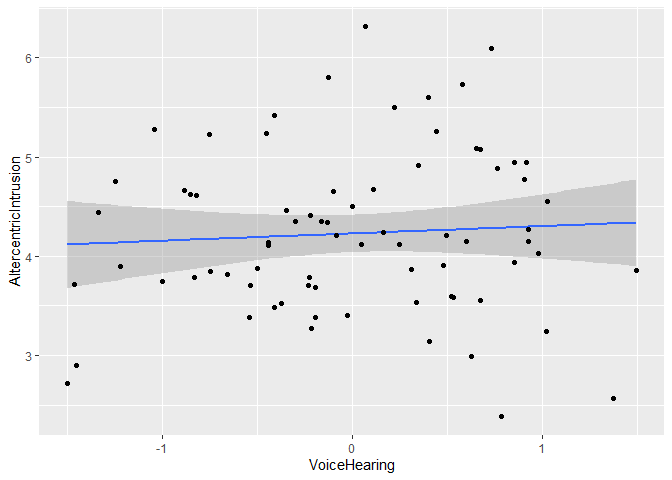

``` r
ggplot(data = d_scz, aes(x = MindReading, y = AltercentricIntrusion)) + 
  geom_smooth(method = 'lm')+ geom_point()
```

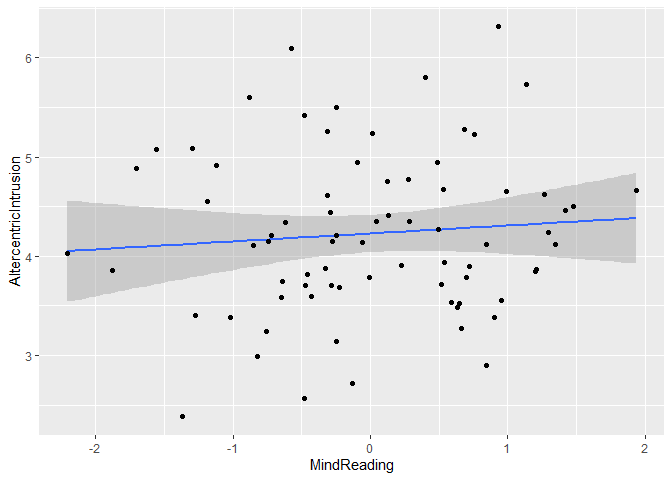

``` r
ggplot(data = d_scz, aes(x = Apathy, y = AltercentricIntrusion)) + 
  geom_smooth(method = 'lm')+ geom_point()
```

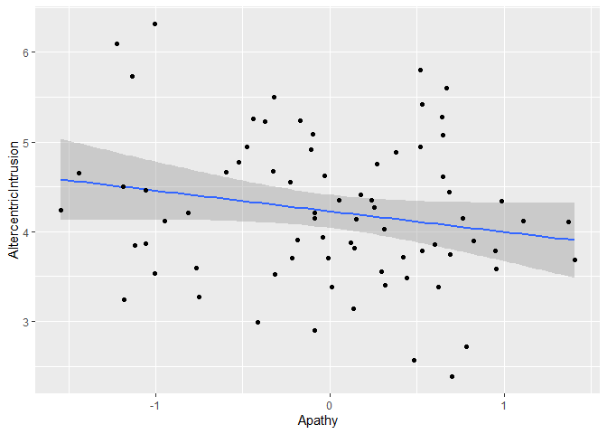

``` r
# priors
prior_symptom <- c(
  prior(normal(4, 1), class = Intercept), # for intercept
  prior(normal(0.5,1), class = b), # for beta
  prior(normal(1, 2), class = sigma) # for uncertinty
) 

prior_apathy<- c(
  prior(normal(4, 1), class = Intercept), # for intercept
  prior(normal(-0.5,1), class = b), # for beta
  prior(normal(1, 2), class = sigma) # for uncertinty
) 

# Test the priors

AltercentricVH_PriorCheck_m <- brm(
  formula = AltercentricVH_f,
  data = d_scz,
  family = gaussian,
  prior = prior_symptom,
  sample_prior = "only"
)
```

    ## Compiling the C++ model

    ## Start sampling

    ## 
    ## SAMPLING FOR MODEL '444db89f11ba09c813b70a02d5399d9d' NOW (CHAIN 1).
    ## Chain 1: 
    ## Chain 1: Gradient evaluation took 0 seconds
    ## Chain 1: 1000 transitions using 10 leapfrog steps per transition would take 0 seconds.
    ## Chain 1: Adjust your expectations accordingly!
    ## Chain 1: 
    ## Chain 1: 
    ## Chain 1: Iteration:    1 / 2000 [  0%]  (Warmup)
    ## Chain 1: Iteration:  200 / 2000 [ 10%]  (Warmup)
    ## Chain 1: Iteration:  400 / 2000 [ 20%]  (Warmup)
    ## Chain 1: Iteration:  600 / 2000 [ 30%]  (Warmup)
    ## Chain 1: Iteration:  800 / 2000 [ 40%]  (Warmup)
    ## Chain 1: Iteration: 1000 / 2000 [ 50%]  (Warmup)
    ## Chain 1: Iteration: 1001 / 2000 [ 50%]  (Sampling)
    ## Chain 1: Iteration: 1200 / 2000 [ 60%]  (Sampling)
    ## Chain 1: Iteration: 1400 / 2000 [ 70%]  (Sampling)
    ## Chain 1: Iteration: 1600 / 2000 [ 80%]  (Sampling)
    ## Chain 1: Iteration: 1800 / 2000 [ 90%]  (Sampling)
    ## Chain 1: Iteration: 2000 / 2000 [100%]  (Sampling)
    ## Chain 1: 
    ## Chain 1:  Elapsed Time: 0.038 seconds (Warm-up)
    ## Chain 1:                0.036 seconds (Sampling)
    ## Chain 1:                0.074 seconds (Total)
    ## Chain 1: 
    ## 
    ## SAMPLING FOR MODEL '444db89f11ba09c813b70a02d5399d9d' NOW (CHAIN 2).
    ## Chain 2: 
    ## Chain 2: Gradient evaluation took 0 seconds
    ## Chain 2: 1000 transitions using 10 leapfrog steps per transition would take 0 seconds.
    ## Chain 2: Adjust your expectations accordingly!
    ## Chain 2: 
    ## Chain 2: 
    ## Chain 2: Iteration:    1 / 2000 [  0%]  (Warmup)
    ## Chain 2: Iteration:  200 / 2000 [ 10%]  (Warmup)
    ## Chain 2: Iteration:  400 / 2000 [ 20%]  (Warmup)
    ## Chain 2: Iteration:  600 / 2000 [ 30%]  (Warmup)
    ## Chain 2: Iteration:  800 / 2000 [ 40%]  (Warmup)
    ## Chain 2: Iteration: 1000 / 2000 [ 50%]  (Warmup)
    ## Chain 2: Iteration: 1001 / 2000 [ 50%]  (Sampling)
    ## Chain 2: Iteration: 1200 / 2000 [ 60%]  (Sampling)
    ## Chain 2: Iteration: 1400 / 2000 [ 70%]  (Sampling)
    ## Chain 2: Iteration: 1600 / 2000 [ 80%]  (Sampling)
    ## Chain 2: Iteration: 1800 / 2000 [ 90%]  (Sampling)
    ## Chain 2: Iteration: 2000 / 2000 [100%]  (Sampling)
    ## Chain 2: 
    ## Chain 2:  Elapsed Time: 0.033 seconds (Warm-up)
    ## Chain 2:                0.028 seconds (Sampling)
    ## Chain 2:                0.061 seconds (Total)
    ## Chain 2: 
    ## 
    ## SAMPLING FOR MODEL '444db89f11ba09c813b70a02d5399d9d' NOW (CHAIN 3).
    ## Chain 3: 
    ## Chain 3: Gradient evaluation took 0 seconds
    ## Chain 3: 1000 transitions using 10 leapfrog steps per transition would take 0 seconds.
    ## Chain 3: Adjust your expectations accordingly!
    ## Chain 3: 
    ## Chain 3: 
    ## Chain 3: Iteration:    1 / 2000 [  0%]  (Warmup)
    ## Chain 3: Iteration:  200 / 2000 [ 10%]  (Warmup)
    ## Chain 3: Iteration:  400 / 2000 [ 20%]  (Warmup)
    ## Chain 3: Iteration:  600 / 2000 [ 30%]  (Warmup)
    ## Chain 3: Iteration:  800 / 2000 [ 40%]  (Warmup)
    ## Chain 3: Iteration: 1000 / 2000 [ 50%]  (Warmup)
    ## Chain 3: Iteration: 1001 / 2000 [ 50%]  (Sampling)
    ## Chain 3: Iteration: 1200 / 2000 [ 60%]  (Sampling)
    ## Chain 3: Iteration: 1400 / 2000 [ 70%]  (Sampling)
    ## Chain 3: Iteration: 1600 / 2000 [ 80%]  (Sampling)
    ## Chain 3: Iteration: 1800 / 2000 [ 90%]  (Sampling)
    ## Chain 3: Iteration: 2000 / 2000 [100%]  (Sampling)
    ## Chain 3: 
    ## Chain 3:  Elapsed Time: 0.038 seconds (Warm-up)
    ## Chain 3:                0.029 seconds (Sampling)
    ## Chain 3:                0.067 seconds (Total)
    ## Chain 3: 
    ## 
    ## SAMPLING FOR MODEL '444db89f11ba09c813b70a02d5399d9d' NOW (CHAIN 4).
    ## Chain 4: 
    ## Chain 4: Gradient evaluation took 0 seconds
    ## Chain 4: 1000 transitions using 10 leapfrog steps per transition would take 0 seconds.
    ## Chain 4: Adjust your expectations accordingly!
    ## Chain 4: 
    ## Chain 4: 
    ## Chain 4: Iteration:    1 / 2000 [  0%]  (Warmup)
    ## Chain 4: Iteration:  200 / 2000 [ 10%]  (Warmup)
    ## Chain 4: Iteration:  400 / 2000 [ 20%]  (Warmup)
    ## Chain 4: Iteration:  600 / 2000 [ 30%]  (Warmup)
    ## Chain 4: Iteration:  800 / 2000 [ 40%]  (Warmup)
    ## Chain 4: Iteration: 1000 / 2000 [ 50%]  (Warmup)
    ## Chain 4: Iteration: 1001 / 2000 [ 50%]  (Sampling)
    ## Chain 4: Iteration: 1200 / 2000 [ 60%]  (Sampling)
    ## Chain 4: Iteration: 1400 / 2000 [ 70%]  (Sampling)
    ## Chain 4: Iteration: 1600 / 2000 [ 80%]  (Sampling)
    ## Chain 4: Iteration: 1800 / 2000 [ 90%]  (Sampling)
    ## Chain 4: Iteration: 2000 / 2000 [100%]  (Sampling)
    ## Chain 4: 
    ## Chain 4:  Elapsed Time: 0.039 seconds (Warm-up)
    ## Chain 4:                0.033 seconds (Sampling)
    ## Chain 4:                0.072 seconds (Total)
    ## Chain 4:

    ## Warning: There were 3 divergent transitions after warmup. Increasing adapt_delta above 0.8 may help. See
    ## http://mc-stan.org/misc/warnings.html#divergent-transitions-after-warmup

    ## Warning: Examine the pairs() plot to diagnose sampling problems

``` r
pp_check(AltercentricVH_PriorCheck_m, nsamples = 100)
```

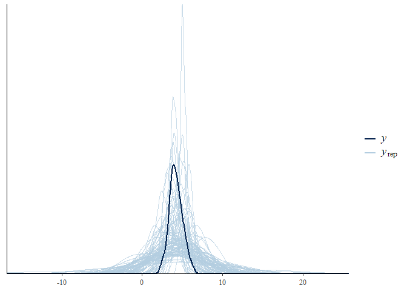

``` r
AltercentricMR_PriorCheck_m <- brm(
  formula = AltercentricVH_f,
  data = d_scz,
  family = gaussian,
  prior = prior_symptom,
  sample_prior = "only"
)
```

    ## Compiling the C++ model

    ## recompiling to avoid crashing R session

    ## Start sampling

    ## 
    ## SAMPLING FOR MODEL '444db89f11ba09c813b70a02d5399d9d' NOW (CHAIN 1).
    ## Chain 1: 
    ## Chain 1: Gradient evaluation took 0 seconds
    ## Chain 1: 1000 transitions using 10 leapfrog steps per transition would take 0 seconds.
    ## Chain 1: Adjust your expectations accordingly!
    ## Chain 1: 
    ## Chain 1: 
    ## Chain 1: Iteration:    1 / 2000 [  0%]  (Warmup)
    ## Chain 1: Iteration:  200 / 2000 [ 10%]  (Warmup)
    ## Chain 1: Iteration:  400 / 2000 [ 20%]  (Warmup)
    ## Chain 1: Iteration:  600 / 2000 [ 30%]  (Warmup)
    ## Chain 1: Iteration:  800 / 2000 [ 40%]  (Warmup)
    ## Chain 1: Iteration: 1000 / 2000 [ 50%]  (Warmup)
    ## Chain 1: Iteration: 1001 / 2000 [ 50%]  (Sampling)
    ## Chain 1: Iteration: 1200 / 2000 [ 60%]  (Sampling)
    ## Chain 1: Iteration: 1400 / 2000 [ 70%]  (Sampling)
    ## Chain 1: Iteration: 1600 / 2000 [ 80%]  (Sampling)
    ## Chain 1: Iteration: 1800 / 2000 [ 90%]  (Sampling)
    ## Chain 1: Iteration: 2000 / 2000 [100%]  (Sampling)
    ## Chain 1: 
    ## Chain 1:  Elapsed Time: 0.034 seconds (Warm-up)
    ## Chain 1:                0.03 seconds (Sampling)
    ## Chain 1:                0.064 seconds (Total)
    ## Chain 1: 
    ## 
    ## SAMPLING FOR MODEL '444db89f11ba09c813b70a02d5399d9d' NOW (CHAIN 2).
    ## Chain 2: 
    ## Chain 2: Gradient evaluation took 0 seconds
    ## Chain 2: 1000 transitions using 10 leapfrog steps per transition would take 0 seconds.
    ## Chain 2: Adjust your expectations accordingly!
    ## Chain 2: 
    ## Chain 2: 
    ## Chain 2: Iteration:    1 / 2000 [  0%]  (Warmup)
    ## Chain 2: Iteration:  200 / 2000 [ 10%]  (Warmup)
    ## Chain 2: Iteration:  400 / 2000 [ 20%]  (Warmup)
    ## Chain 2: Iteration:  600 / 2000 [ 30%]  (Warmup)
    ## Chain 2: Iteration:  800 / 2000 [ 40%]  (Warmup)
    ## Chain 2: Iteration: 1000 / 2000 [ 50%]  (Warmup)
    ## Chain 2: Iteration: 1001 / 2000 [ 50%]  (Sampling)
    ## Chain 2: Iteration: 1200 / 2000 [ 60%]  (Sampling)
    ## Chain 2: Iteration: 1400 / 2000 [ 70%]  (Sampling)
    ## Chain 2: Iteration: 1600 / 2000 [ 80%]  (Sampling)
    ## Chain 2: Iteration: 1800 / 2000 [ 90%]  (Sampling)
    ## Chain 2: Iteration: 2000 / 2000 [100%]  (Sampling)
    ## Chain 2: 
    ## Chain 2:  Elapsed Time: 0.036 seconds (Warm-up)
    ## Chain 2:                0.03 seconds (Sampling)
    ## Chain 2:                0.066 seconds (Total)
    ## Chain 2: 
    ## 
    ## SAMPLING FOR MODEL '444db89f11ba09c813b70a02d5399d9d' NOW (CHAIN 3).
    ## Chain 3: 
    ## Chain 3: Gradient evaluation took 0 seconds
    ## Chain 3: 1000 transitions using 10 leapfrog steps per transition would take 0 seconds.
    ## Chain 3: Adjust your expectations accordingly!
    ## Chain 3: 
    ## Chain 3: 
    ## Chain 3: Iteration:    1 / 2000 [  0%]  (Warmup)
    ## Chain 3: Iteration:  200 / 2000 [ 10%]  (Warmup)
    ## Chain 3: Iteration:  400 / 2000 [ 20%]  (Warmup)
    ## Chain 3: Iteration:  600 / 2000 [ 30%]  (Warmup)
    ## Chain 3: Iteration:  800 / 2000 [ 40%]  (Warmup)
    ## Chain 3: Iteration: 1000 / 2000 [ 50%]  (Warmup)
    ## Chain 3: Iteration: 1001 / 2000 [ 50%]  (Sampling)
    ## Chain 3: Iteration: 1200 / 2000 [ 60%]  (Sampling)
    ## Chain 3: Iteration: 1400 / 2000 [ 70%]  (Sampling)
    ## Chain 3: Iteration: 1600 / 2000 [ 80%]  (Sampling)
    ## Chain 3: Iteration: 1800 / 2000 [ 90%]  (Sampling)
    ## Chain 3: Iteration: 2000 / 2000 [100%]  (Sampling)
    ## Chain 3: 
    ## Chain 3:  Elapsed Time: 0.038 seconds (Warm-up)
    ## Chain 3:                0.033 seconds (Sampling)
    ## Chain 3:                0.071 seconds (Total)
    ## Chain 3: 
    ## 
    ## SAMPLING FOR MODEL '444db89f11ba09c813b70a02d5399d9d' NOW (CHAIN 4).
    ## Chain 4: 
    ## Chain 4: Gradient evaluation took 0 seconds
    ## Chain 4: 1000 transitions using 10 leapfrog steps per transition would take 0 seconds.
    ## Chain 4: Adjust your expectations accordingly!
    ## Chain 4: 
    ## Chain 4: 
    ## Chain 4: Iteration:    1 / 2000 [  0%]  (Warmup)
    ## Chain 4: Iteration:  200 / 2000 [ 10%]  (Warmup)
    ## Chain 4: Iteration:  400 / 2000 [ 20%]  (Warmup)
    ## Chain 4: Iteration:  600 / 2000 [ 30%]  (Warmup)
    ## Chain 4: Iteration:  800 / 2000 [ 40%]  (Warmup)
    ## Chain 4: Iteration: 1000 / 2000 [ 50%]  (Warmup)
    ## Chain 4: Iteration: 1001 / 2000 [ 50%]  (Sampling)
    ## Chain 4: Iteration: 1200 / 2000 [ 60%]  (Sampling)
    ## Chain 4: Iteration: 1400 / 2000 [ 70%]  (Sampling)
    ## Chain 4: Iteration: 1600 / 2000 [ 80%]  (Sampling)
    ## Chain 4: Iteration: 1800 / 2000 [ 90%]  (Sampling)
    ## Chain 4: Iteration: 2000 / 2000 [100%]  (Sampling)
    ## Chain 4: 
    ## Chain 4:  Elapsed Time: 0.034 seconds (Warm-up)
    ## Chain 4:                0.039 seconds (Sampling)
    ## Chain 4:                0.073 seconds (Total)
    ## Chain 4:

``` r
pp_check(AltercentricMR_PriorCheck_m, nsamples = 100)
```

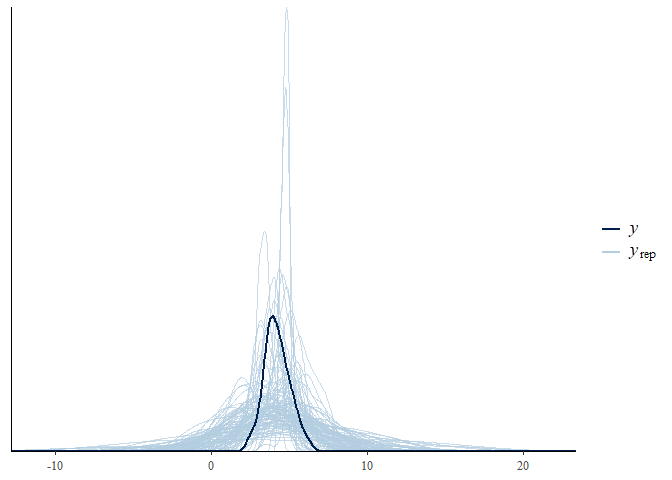

``` r
AltercentricApathy_PriorCheck_m <- brm(
  formula = AltercentricVH_f,
  data = d_scz,
  family = gaussian,
  prior = prior_apathy,
  sample_prior = "only"
)
```

    ## Compiling the C++ model
    ## Start sampling

    ## 
    ## SAMPLING FOR MODEL '58647de4bd2c9f08f5f3046bbc757b41' NOW (CHAIN 1).
    ## Chain 1: 
    ## Chain 1: Gradient evaluation took 0 seconds
    ## Chain 1: 1000 transitions using 10 leapfrog steps per transition would take 0 seconds.
    ## Chain 1: Adjust your expectations accordingly!
    ## Chain 1: 
    ## Chain 1: 
    ## Chain 1: Iteration:    1 / 2000 [  0%]  (Warmup)
    ## Chain 1: Iteration:  200 / 2000 [ 10%]  (Warmup)
    ## Chain 1: Iteration:  400 / 2000 [ 20%]  (Warmup)
    ## Chain 1: Iteration:  600 / 2000 [ 30%]  (Warmup)
    ## Chain 1: Iteration:  800 / 2000 [ 40%]  (Warmup)
    ## Chain 1: Iteration: 1000 / 2000 [ 50%]  (Warmup)
    ## Chain 1: Iteration: 1001 / 2000 [ 50%]  (Sampling)
    ## Chain 1: Iteration: 1200 / 2000 [ 60%]  (Sampling)
    ## Chain 1: Iteration: 1400 / 2000 [ 70%]  (Sampling)
    ## Chain 1: Iteration: 1600 / 2000 [ 80%]  (Sampling)
    ## Chain 1: Iteration: 1800 / 2000 [ 90%]  (Sampling)
    ## Chain 1: Iteration: 2000 / 2000 [100%]  (Sampling)
    ## Chain 1: 
    ## Chain 1:  Elapsed Time: 0.033 seconds (Warm-up)
    ## Chain 1:                0.038 seconds (Sampling)
    ## Chain 1:                0.071 seconds (Total)
    ## Chain 1: 
    ## 
    ## SAMPLING FOR MODEL '58647de4bd2c9f08f5f3046bbc757b41' NOW (CHAIN 2).
    ## Chain 2: 
    ## Chain 2: Gradient evaluation took 0 seconds
    ## Chain 2: 1000 transitions using 10 leapfrog steps per transition would take 0 seconds.
    ## Chain 2: Adjust your expectations accordingly!
    ## Chain 2: 
    ## Chain 2: 
    ## Chain 2: Iteration:    1 / 2000 [  0%]  (Warmup)
    ## Chain 2: Iteration:  200 / 2000 [ 10%]  (Warmup)
    ## Chain 2: Iteration:  400 / 2000 [ 20%]  (Warmup)
    ## Chain 2: Iteration:  600 / 2000 [ 30%]  (Warmup)
    ## Chain 2: Iteration:  800 / 2000 [ 40%]  (Warmup)
    ## Chain 2: Iteration: 1000 / 2000 [ 50%]  (Warmup)
    ## Chain 2: Iteration: 1001 / 2000 [ 50%]  (Sampling)
    ## Chain 2: Iteration: 1200 / 2000 [ 60%]  (Sampling)
    ## Chain 2: Iteration: 1400 / 2000 [ 70%]  (Sampling)
    ## Chain 2: Iteration: 1600 / 2000 [ 80%]  (Sampling)
    ## Chain 2: Iteration: 1800 / 2000 [ 90%]  (Sampling)
    ## Chain 2: Iteration: 2000 / 2000 [100%]  (Sampling)
    ## Chain 2: 
    ## Chain 2:  Elapsed Time: 0.034 seconds (Warm-up)
    ## Chain 2:                0.04 seconds (Sampling)
    ## Chain 2:                0.074 seconds (Total)
    ## Chain 2: 
    ## 
    ## SAMPLING FOR MODEL '58647de4bd2c9f08f5f3046bbc757b41' NOW (CHAIN 3).
    ## Chain 3: 
    ## Chain 3: Gradient evaluation took 0 seconds
    ## Chain 3: 1000 transitions using 10 leapfrog steps per transition would take 0 seconds.
    ## Chain 3: Adjust your expectations accordingly!
    ## Chain 3: 
    ## Chain 3: 
    ## Chain 3: Iteration:    1 / 2000 [  0%]  (Warmup)
    ## Chain 3: Iteration:  200 / 2000 [ 10%]  (Warmup)
    ## Chain 3: Iteration:  400 / 2000 [ 20%]  (Warmup)
    ## Chain 3: Iteration:  600 / 2000 [ 30%]  (Warmup)
    ## Chain 3: Iteration:  800 / 2000 [ 40%]  (Warmup)
    ## Chain 3: Iteration: 1000 / 2000 [ 50%]  (Warmup)
    ## Chain 3: Iteration: 1001 / 2000 [ 50%]  (Sampling)
    ## Chain 3: Iteration: 1200 / 2000 [ 60%]  (Sampling)
    ## Chain 3: Iteration: 1400 / 2000 [ 70%]  (Sampling)
    ## Chain 3: Iteration: 1600 / 2000 [ 80%]  (Sampling)
    ## Chain 3: Iteration: 1800 / 2000 [ 90%]  (Sampling)
    ## Chain 3: Iteration: 2000 / 2000 [100%]  (Sampling)
    ## Chain 3: 
    ## Chain 3:  Elapsed Time: 0.034 seconds (Warm-up)
    ## Chain 3:                0.031 seconds (Sampling)
    ## Chain 3:                0.065 seconds (Total)
    ## Chain 3: 
    ## 
    ## SAMPLING FOR MODEL '58647de4bd2c9f08f5f3046bbc757b41' NOW (CHAIN 4).
    ## Chain 4: 
    ## Chain 4: Gradient evaluation took 0 seconds
    ## Chain 4: 1000 transitions using 10 leapfrog steps per transition would take 0 seconds.
    ## Chain 4: Adjust your expectations accordingly!
    ## Chain 4: 
    ## Chain 4: 
    ## Chain 4: Iteration:    1 / 2000 [  0%]  (Warmup)
    ## Chain 4: Iteration:  200 / 2000 [ 10%]  (Warmup)
    ## Chain 4: Iteration:  400 / 2000 [ 20%]  (Warmup)
    ## Chain 4: Iteration:  600 / 2000 [ 30%]  (Warmup)
    ## Chain 4: Iteration:  800 / 2000 [ 40%]  (Warmup)
    ## Chain 4: Iteration: 1000 / 2000 [ 50%]  (Warmup)
    ## Chain 4: Iteration: 1001 / 2000 [ 50%]  (Sampling)
    ## Chain 4: Iteration: 1200 / 2000 [ 60%]  (Sampling)
    ## Chain 4: Iteration: 1400 / 2000 [ 70%]  (Sampling)
    ## Chain 4: Iteration: 1600 / 2000 [ 80%]  (Sampling)
    ## Chain 4: Iteration: 1800 / 2000 [ 90%]  (Sampling)
    ## Chain 4: Iteration: 2000 / 2000 [100%]  (Sampling)
    ## Chain 4: 
    ## Chain 4:  Elapsed Time: 0.033 seconds (Warm-up)
    ## Chain 4:                0.036 seconds (Sampling)
    ## Chain 4:                0.069 seconds (Total)
    ## Chain 4:

    ## Warning: There were 1 divergent transitions after warmup. Increasing adapt_delta above 0.8 may help. See
    ## http://mc-stan.org/misc/warnings.html#divergent-transitions-after-warmup

    ## Warning: Examine the pairs() plot to diagnose sampling problems

``` r
pp_check(AltercentricApathy_PriorCheck_m, nsamples = 100)
```

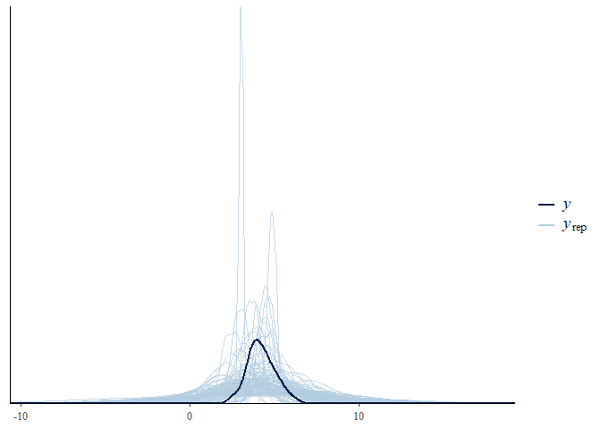

``` r
## Fitting the model
AltercentricVH_m <- brm(
  formula = AltercentricVH_f,
  data = d_scz,
  family = gaussian,
  prior = prior_symptom,
  sample_prior = T
)
```

    ## Compiling the C++ model
    ## Start sampling

    ## 
    ## SAMPLING FOR MODEL '87e78a9d331662199996efd50cc54464' NOW (CHAIN 1).
    ## Chain 1: 
    ## Chain 1: Gradient evaluation took 0 seconds
    ## Chain 1: 1000 transitions using 10 leapfrog steps per transition would take 0 seconds.
    ## Chain 1: Adjust your expectations accordingly!
    ## Chain 1: 
    ## Chain 1: 
    ## Chain 1: Iteration:    1 / 2000 [  0%]  (Warmup)
    ## Chain 1: Iteration:  200 / 2000 [ 10%]  (Warmup)
    ## Chain 1: Iteration:  400 / 2000 [ 20%]  (Warmup)
    ## Chain 1: Iteration:  600 / 2000 [ 30%]  (Warmup)
    ## Chain 1: Iteration:  800 / 2000 [ 40%]  (Warmup)
    ## Chain 1: Iteration: 1000 / 2000 [ 50%]  (Warmup)
    ## Chain 1: Iteration: 1001 / 2000 [ 50%]  (Sampling)
    ## Chain 1: Iteration: 1200 / 2000 [ 60%]  (Sampling)
    ## Chain 1: Iteration: 1400 / 2000 [ 70%]  (Sampling)
    ## Chain 1: Iteration: 1600 / 2000 [ 80%]  (Sampling)
    ## Chain 1: Iteration: 1800 / 2000 [ 90%]  (Sampling)
    ## Chain 1: Iteration: 2000 / 2000 [100%]  (Sampling)
    ## Chain 1: 
    ## Chain 1:  Elapsed Time: 0.037 seconds (Warm-up)
    ## Chain 1:                0.041 seconds (Sampling)
    ## Chain 1:                0.078 seconds (Total)
    ## Chain 1: 
    ## 
    ## SAMPLING FOR MODEL '87e78a9d331662199996efd50cc54464' NOW (CHAIN 2).
    ## Chain 2: 
    ## Chain 2: Gradient evaluation took 0 seconds
    ## Chain 2: 1000 transitions using 10 leapfrog steps per transition would take 0 seconds.
    ## Chain 2: Adjust your expectations accordingly!
    ## Chain 2: 
    ## Chain 2: 
    ## Chain 2: Iteration:    1 / 2000 [  0%]  (Warmup)
    ## Chain 2: Iteration:  200 / 2000 [ 10%]  (Warmup)
    ## Chain 2: Iteration:  400 / 2000 [ 20%]  (Warmup)
    ## Chain 2: Iteration:  600 / 2000 [ 30%]  (Warmup)
    ## Chain 2: Iteration:  800 / 2000 [ 40%]  (Warmup)
    ## Chain 2: Iteration: 1000 / 2000 [ 50%]  (Warmup)
    ## Chain 2: Iteration: 1001 / 2000 [ 50%]  (Sampling)
    ## Chain 2: Iteration: 1200 / 2000 [ 60%]  (Sampling)
    ## Chain 2: Iteration: 1400 / 2000 [ 70%]  (Sampling)
    ## Chain 2: Iteration: 1600 / 2000 [ 80%]  (Sampling)
    ## Chain 2: Iteration: 1800 / 2000 [ 90%]  (Sampling)
    ## Chain 2: Iteration: 2000 / 2000 [100%]  (Sampling)
    ## Chain 2: 
    ## Chain 2:  Elapsed Time: 0.036 seconds (Warm-up)
    ## Chain 2:                0.036 seconds (Sampling)
    ## Chain 2:                0.072 seconds (Total)
    ## Chain 2: 
    ## 
    ## SAMPLING FOR MODEL '87e78a9d331662199996efd50cc54464' NOW (CHAIN 3).
    ## Chain 3: 
    ## Chain 3: Gradient evaluation took 0 seconds
    ## Chain 3: 1000 transitions using 10 leapfrog steps per transition would take 0 seconds.
    ## Chain 3: Adjust your expectations accordingly!
    ## Chain 3: 
    ## Chain 3: 
    ## Chain 3: Iteration:    1 / 2000 [  0%]  (Warmup)
    ## Chain 3: Iteration:  200 / 2000 [ 10%]  (Warmup)
    ## Chain 3: Iteration:  400 / 2000 [ 20%]  (Warmup)
    ## Chain 3: Iteration:  600 / 2000 [ 30%]  (Warmup)
    ## Chain 3: Iteration:  800 / 2000 [ 40%]  (Warmup)
    ## Chain 3: Iteration: 1000 / 2000 [ 50%]  (Warmup)
    ## Chain 3: Iteration: 1001 / 2000 [ 50%]  (Sampling)
    ## Chain 3: Iteration: 1200 / 2000 [ 60%]  (Sampling)
    ## Chain 3: Iteration: 1400 / 2000 [ 70%]  (Sampling)
    ## Chain 3: Iteration: 1600 / 2000 [ 80%]  (Sampling)
    ## Chain 3: Iteration: 1800 / 2000 [ 90%]  (Sampling)
    ## Chain 3: Iteration: 2000 / 2000 [100%]  (Sampling)
    ## Chain 3: 
    ## Chain 3:  Elapsed Time: 0.037 seconds (Warm-up)
    ## Chain 3:                0.044 seconds (Sampling)
    ## Chain 3:                0.081 seconds (Total)
    ## Chain 3: 
    ## 
    ## SAMPLING FOR MODEL '87e78a9d331662199996efd50cc54464' NOW (CHAIN 4).
    ## Chain 4: 
    ## Chain 4: Gradient evaluation took 0 seconds
    ## Chain 4: 1000 transitions using 10 leapfrog steps per transition would take 0 seconds.
    ## Chain 4: Adjust your expectations accordingly!
    ## Chain 4: 
    ## Chain 4: 
    ## Chain 4: Iteration:    1 / 2000 [  0%]  (Warmup)
    ## Chain 4: Iteration:  200 / 2000 [ 10%]  (Warmup)
    ## Chain 4: Iteration:  400 / 2000 [ 20%]  (Warmup)
    ## Chain 4: Iteration:  600 / 2000 [ 30%]  (Warmup)
    ## Chain 4: Iteration:  800 / 2000 [ 40%]  (Warmup)
    ## Chain 4: Iteration: 1000 / 2000 [ 50%]  (Warmup)
    ## Chain 4: Iteration: 1001 / 2000 [ 50%]  (Sampling)
    ## Chain 4: Iteration: 1200 / 2000 [ 60%]  (Sampling)
    ## Chain 4: Iteration: 1400 / 2000 [ 70%]  (Sampling)
    ## Chain 4: Iteration: 1600 / 2000 [ 80%]  (Sampling)
    ## Chain 4: Iteration: 1800 / 2000 [ 90%]  (Sampling)
    ## Chain 4: Iteration: 2000 / 2000 [100%]  (Sampling)
    ## Chain 4: 
    ## Chain 4:  Elapsed Time: 0.035 seconds (Warm-up)
    ## Chain 4:                0.035 seconds (Sampling)
    ## Chain 4:                0.07 seconds (Total)
    ## Chain 4:

``` r
AltercentricMR_m <- brm(
  formula = AltercentricMR_f,
  data = d_scz,
  family = gaussian,
  prior = prior_symptom,
  sample_prior = T
)
```

    ## Compiling the C++ model

    ## recompiling to avoid crashing R session

    ## Start sampling

    ## 
    ## SAMPLING FOR MODEL '87e78a9d331662199996efd50cc54464' NOW (CHAIN 1).
    ## Chain 1: 
    ## Chain 1: Gradient evaluation took 0 seconds
    ## Chain 1: 1000 transitions using 10 leapfrog steps per transition would take 0 seconds.
    ## Chain 1: Adjust your expectations accordingly!
    ## Chain 1: 
    ## Chain 1: 
    ## Chain 1: Iteration:    1 / 2000 [  0%]  (Warmup)
    ## Chain 1: Iteration:  200 / 2000 [ 10%]  (Warmup)
    ## Chain 1: Iteration:  400 / 2000 [ 20%]  (Warmup)
    ## Chain 1: Iteration:  600 / 2000 [ 30%]  (Warmup)
    ## Chain 1: Iteration:  800 / 2000 [ 40%]  (Warmup)
    ## Chain 1: Iteration: 1000 / 2000 [ 50%]  (Warmup)
    ## Chain 1: Iteration: 1001 / 2000 [ 50%]  (Sampling)
    ## Chain 1: Iteration: 1200 / 2000 [ 60%]  (Sampling)
    ## Chain 1: Iteration: 1400 / 2000 [ 70%]  (Sampling)
    ## Chain 1: Iteration: 1600 / 2000 [ 80%]  (Sampling)
    ## Chain 1: Iteration: 1800 / 2000 [ 90%]  (Sampling)
    ## Chain 1: Iteration: 2000 / 2000 [100%]  (Sampling)
    ## Chain 1: 
    ## Chain 1:  Elapsed Time: 0.037 seconds (Warm-up)
    ## Chain 1:                0.04 seconds (Sampling)
    ## Chain 1:                0.077 seconds (Total)
    ## Chain 1: 
    ## 
    ## SAMPLING FOR MODEL '87e78a9d331662199996efd50cc54464' NOW (CHAIN 2).
    ## Chain 2: 
    ## Chain 2: Gradient evaluation took 0 seconds
    ## Chain 2: 1000 transitions using 10 leapfrog steps per transition would take 0 seconds.
    ## Chain 2: Adjust your expectations accordingly!
    ## Chain 2: 
    ## Chain 2: 
    ## Chain 2: Iteration:    1 / 2000 [  0%]  (Warmup)
    ## Chain 2: Iteration:  200 / 2000 [ 10%]  (Warmup)
    ## Chain 2: Iteration:  400 / 2000 [ 20%]  (Warmup)
    ## Chain 2: Iteration:  600 / 2000 [ 30%]  (Warmup)
    ## Chain 2: Iteration:  800 / 2000 [ 40%]  (Warmup)
    ## Chain 2: Iteration: 1000 / 2000 [ 50%]  (Warmup)
    ## Chain 2: Iteration: 1001 / 2000 [ 50%]  (Sampling)
    ## Chain 2: Iteration: 1200 / 2000 [ 60%]  (Sampling)
    ## Chain 2: Iteration: 1400 / 2000 [ 70%]  (Sampling)
    ## Chain 2: Iteration: 1600 / 2000 [ 80%]  (Sampling)
    ## Chain 2: Iteration: 1800 / 2000 [ 90%]  (Sampling)
    ## Chain 2: Iteration: 2000 / 2000 [100%]  (Sampling)
    ## Chain 2: 
    ## Chain 2:  Elapsed Time: 0.035 seconds (Warm-up)
    ## Chain 2:                0.039 seconds (Sampling)
    ## Chain 2:                0.074 seconds (Total)
    ## Chain 2: 
    ## 
    ## SAMPLING FOR MODEL '87e78a9d331662199996efd50cc54464' NOW (CHAIN 3).
    ## Chain 3: 
    ## Chain 3: Gradient evaluation took 0 seconds
    ## Chain 3: 1000 transitions using 10 leapfrog steps per transition would take 0 seconds.
    ## Chain 3: Adjust your expectations accordingly!
    ## Chain 3: 
    ## Chain 3: 
    ## Chain 3: Iteration:    1 / 2000 [  0%]  (Warmup)
    ## Chain 3: Iteration:  200 / 2000 [ 10%]  (Warmup)
    ## Chain 3: Iteration:  400 / 2000 [ 20%]  (Warmup)
    ## Chain 3: Iteration:  600 / 2000 [ 30%]  (Warmup)
    ## Chain 3: Iteration:  800 / 2000 [ 40%]  (Warmup)
    ## Chain 3: Iteration: 1000 / 2000 [ 50%]  (Warmup)
    ## Chain 3: Iteration: 1001 / 2000 [ 50%]  (Sampling)
    ## Chain 3: Iteration: 1200 / 2000 [ 60%]  (Sampling)
    ## Chain 3: Iteration: 1400 / 2000 [ 70%]  (Sampling)
    ## Chain 3: Iteration: 1600 / 2000 [ 80%]  (Sampling)
    ## Chain 3: Iteration: 1800 / 2000 [ 90%]  (Sampling)
    ## Chain 3: Iteration: 2000 / 2000 [100%]  (Sampling)
    ## Chain 3: 
    ## Chain 3:  Elapsed Time: 0.036 seconds (Warm-up)
    ## Chain 3:                0.033 seconds (Sampling)
    ## Chain 3:                0.069 seconds (Total)
    ## Chain 3: 
    ## 
    ## SAMPLING FOR MODEL '87e78a9d331662199996efd50cc54464' NOW (CHAIN 4).
    ## Chain 4: 
    ## Chain 4: Gradient evaluation took 0 seconds
    ## Chain 4: 1000 transitions using 10 leapfrog steps per transition would take 0 seconds.
    ## Chain 4: Adjust your expectations accordingly!
    ## Chain 4: 
    ## Chain 4: 
    ## Chain 4: Iteration:    1 / 2000 [  0%]  (Warmup)
    ## Chain 4: Iteration:  200 / 2000 [ 10%]  (Warmup)
    ## Chain 4: Iteration:  400 / 2000 [ 20%]  (Warmup)
    ## Chain 4: Iteration:  600 / 2000 [ 30%]  (Warmup)
    ## Chain 4: Iteration:  800 / 2000 [ 40%]  (Warmup)
    ## Chain 4: Iteration: 1000 / 2000 [ 50%]  (Warmup)
    ## Chain 4: Iteration: 1001 / 2000 [ 50%]  (Sampling)
    ## Chain 4: Iteration: 1200 / 2000 [ 60%]  (Sampling)
    ## Chain 4: Iteration: 1400 / 2000 [ 70%]  (Sampling)
    ## Chain 4: Iteration: 1600 / 2000 [ 80%]  (Sampling)
    ## Chain 4: Iteration: 1800 / 2000 [ 90%]  (Sampling)
    ## Chain 4: Iteration: 2000 / 2000 [100%]  (Sampling)
    ## Chain 4: 
    ## Chain 4:  Elapsed Time: 0.041 seconds (Warm-up)
    ## Chain 4:                0.03 seconds (Sampling)
    ## Chain 4:                0.071 seconds (Total)
    ## Chain 4:

``` r
AltercentricApathy_m <- brm(
  formula = AltercentricApathy_f,
  data = d_scz,
  family = gaussian,
  prior = prior_apathy,
  sample_prior = T
)
```

    ## Compiling the C++ model
    ## Start sampling

    ## 
    ## SAMPLING FOR MODEL '4e2d527ef9d15722854a2269c07bbc92' NOW (CHAIN 1).
    ## Chain 1: 
    ## Chain 1: Gradient evaluation took 0 seconds
    ## Chain 1: 1000 transitions using 10 leapfrog steps per transition would take 0 seconds.
    ## Chain 1: Adjust your expectations accordingly!
    ## Chain 1: 
    ## Chain 1: 
    ## Chain 1: Iteration:    1 / 2000 [  0%]  (Warmup)
    ## Chain 1: Iteration:  200 / 2000 [ 10%]  (Warmup)
    ## Chain 1: Iteration:  400 / 2000 [ 20%]  (Warmup)
    ## Chain 1: Iteration:  600 / 2000 [ 30%]  (Warmup)
    ## Chain 1: Iteration:  800 / 2000 [ 40%]  (Warmup)
    ## Chain 1: Iteration: 1000 / 2000 [ 50%]  (Warmup)
    ## Chain 1: Iteration: 1001 / 2000 [ 50%]  (Sampling)
    ## Chain 1: Iteration: 1200 / 2000 [ 60%]  (Sampling)
    ## Chain 1: Iteration: 1400 / 2000 [ 70%]  (Sampling)
    ## Chain 1: Iteration: 1600 / 2000 [ 80%]  (Sampling)
    ## Chain 1: Iteration: 1800 / 2000 [ 90%]  (Sampling)
    ## Chain 1: Iteration: 2000 / 2000 [100%]  (Sampling)
    ## Chain 1: 
    ## Chain 1:  Elapsed Time: 0.036 seconds (Warm-up)
    ## Chain 1:                0.039 seconds (Sampling)
    ## Chain 1:                0.075 seconds (Total)
    ## Chain 1: 
    ## 
    ## SAMPLING FOR MODEL '4e2d527ef9d15722854a2269c07bbc92' NOW (CHAIN 2).
    ## Chain 2: 
    ## Chain 2: Gradient evaluation took 0 seconds
    ## Chain 2: 1000 transitions using 10 leapfrog steps per transition would take 0 seconds.
    ## Chain 2: Adjust your expectations accordingly!
    ## Chain 2: 
    ## Chain 2: 
    ## Chain 2: Iteration:    1 / 2000 [  0%]  (Warmup)
    ## Chain 2: Iteration:  200 / 2000 [ 10%]  (Warmup)
    ## Chain 2: Iteration:  400 / 2000 [ 20%]  (Warmup)
    ## Chain 2: Iteration:  600 / 2000 [ 30%]  (Warmup)
    ## Chain 2: Iteration:  800 / 2000 [ 40%]  (Warmup)
    ## Chain 2: Iteration: 1000 / 2000 [ 50%]  (Warmup)
    ## Chain 2: Iteration: 1001 / 2000 [ 50%]  (Sampling)
    ## Chain 2: Iteration: 1200 / 2000 [ 60%]  (Sampling)
    ## Chain 2: Iteration: 1400 / 2000 [ 70%]  (Sampling)
    ## Chain 2: Iteration: 1600 / 2000 [ 80%]  (Sampling)
    ## Chain 2: Iteration: 1800 / 2000 [ 90%]  (Sampling)
    ## Chain 2: Iteration: 2000 / 2000 [100%]  (Sampling)
    ## Chain 2: 
    ## Chain 2:  Elapsed Time: 0.037 seconds (Warm-up)
    ## Chain 2:                0.036 seconds (Sampling)
    ## Chain 2:                0.073 seconds (Total)
    ## Chain 2: 
    ## 
    ## SAMPLING FOR MODEL '4e2d527ef9d15722854a2269c07bbc92' NOW (CHAIN 3).
    ## Chain 3: 
    ## Chain 3: Gradient evaluation took 0 seconds
    ## Chain 3: 1000 transitions using 10 leapfrog steps per transition would take 0 seconds.
    ## Chain 3: Adjust your expectations accordingly!
    ## Chain 3: 
    ## Chain 3: 
    ## Chain 3: Iteration:    1 / 2000 [  0%]  (Warmup)
    ## Chain 3: Iteration:  200 / 2000 [ 10%]  (Warmup)
    ## Chain 3: Iteration:  400 / 2000 [ 20%]  (Warmup)
    ## Chain 3: Iteration:  600 / 2000 [ 30%]  (Warmup)
    ## Chain 3: Iteration:  800 / 2000 [ 40%]  (Warmup)
    ## Chain 3: Iteration: 1000 / 2000 [ 50%]  (Warmup)
    ## Chain 3: Iteration: 1001 / 2000 [ 50%]  (Sampling)
    ## Chain 3: Iteration: 1200 / 2000 [ 60%]  (Sampling)
    ## Chain 3: Iteration: 1400 / 2000 [ 70%]  (Sampling)
    ## Chain 3: Iteration: 1600 / 2000 [ 80%]  (Sampling)
    ## Chain 3: Iteration: 1800 / 2000 [ 90%]  (Sampling)
    ## Chain 3: Iteration: 2000 / 2000 [100%]  (Sampling)
    ## Chain 3: 
    ## Chain 3:  Elapsed Time: 0.034 seconds (Warm-up)
    ## Chain 3:                0.04 seconds (Sampling)
    ## Chain 3:                0.074 seconds (Total)
    ## Chain 3: 
    ## 
    ## SAMPLING FOR MODEL '4e2d527ef9d15722854a2269c07bbc92' NOW (CHAIN 4).
    ## Chain 4: 
    ## Chain 4: Gradient evaluation took 0 seconds
    ## Chain 4: 1000 transitions using 10 leapfrog steps per transition would take 0 seconds.
    ## Chain 4: Adjust your expectations accordingly!
    ## Chain 4: 
    ## Chain 4: 
    ## Chain 4: Iteration:    1 / 2000 [  0%]  (Warmup)
    ## Chain 4: Iteration:  200 / 2000 [ 10%]  (Warmup)
    ## Chain 4: Iteration:  400 / 2000 [ 20%]  (Warmup)
    ## Chain 4: Iteration:  600 / 2000 [ 30%]  (Warmup)
    ## Chain 4: Iteration:  800 / 2000 [ 40%]  (Warmup)
    ## Chain 4: Iteration: 1000 / 2000 [ 50%]  (Warmup)
    ## Chain 4: Iteration: 1001 / 2000 [ 50%]  (Sampling)
    ## Chain 4: Iteration: 1200 / 2000 [ 60%]  (Sampling)
    ## Chain 4: Iteration: 1400 / 2000 [ 70%]  (Sampling)
    ## Chain 4: Iteration: 1600 / 2000 [ 80%]  (Sampling)
    ## Chain 4: Iteration: 1800 / 2000 [ 90%]  (Sampling)
    ## Chain 4: Iteration: 2000 / 2000 [100%]  (Sampling)
    ## Chain 4: 
    ## Chain 4:  Elapsed Time: 0.04 seconds (Warm-up)
    ## Chain 4:                0.039 seconds (Sampling)
    ## Chain 4:                0.079 seconds (Total)
    ## Chain 4:

``` r
# Posterior predictive check
pp_check(AltercentricVH_m, nsamples = 100)
```

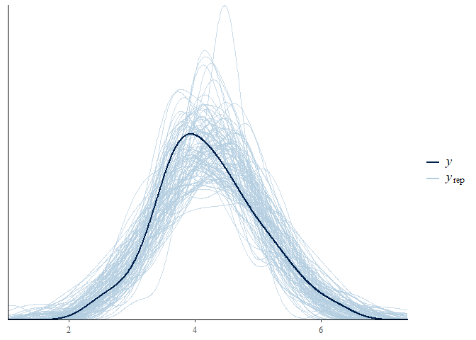

``` r
pp_check(AltercentricMR_m, nsamples = 100)
```

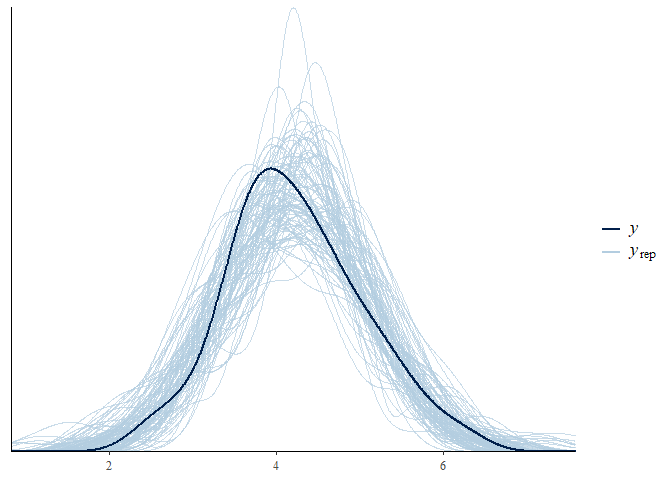

``` r
pp_check(AltercentricApathy_m, nsamples = 100)
```

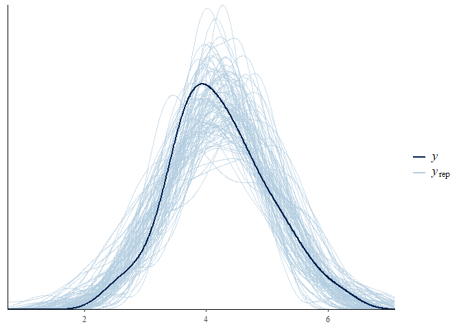

``` r
# Model
AltercentricVH_m
```

    ##  Family: gaussian 
    ##   Links: mu = identity; sigma = identity 
    ## Formula: AltercentricIntrusion ~ 1 + VoiceHearing 
    ##    Data: d_scz (Number of observations: 75) 
    ## Samples: 4 chains, each with iter = 2000; warmup = 1000; thin = 1;
    ##          total post-warmup samples = 4000
    ## 
    ## Population-Level Effects: 
    ##              Estimate Est.Error l-95% CI u-95% CI Rhat Bulk_ESS Tail_ESS
    ## Intercept        4.22      0.10     4.03     4.41 1.00     3593     3037
    ## VoiceHearing     0.08      0.13    -0.18     0.34 1.00     3964     2836
    ## 
    ## Family Specific Parameters: 
    ##       Estimate Est.Error l-95% CI u-95% CI Rhat Bulk_ESS Tail_ESS
    ## sigma     0.84      0.07     0.71     0.99 1.00     3733     2801
    ## 
    ## Samples were drawn using sampling(NUTS). For each parameter, Bulk_ESS
    ## and Tail_ESS are effective sample size measures, and Rhat is the potential
    ## scale reduction factor on split chains (at convergence, Rhat = 1).

``` r
AltercentricMR_m
```

    ##  Family: gaussian 
    ##   Links: mu = identity; sigma = identity 
    ## Formula: AltercentricIntrusion ~ 1 + MindReading 
    ##    Data: d_scz (Number of observations: 75) 
    ## Samples: 4 chains, each with iter = 2000; warmup = 1000; thin = 1;
    ##          total post-warmup samples = 4000
    ## 
    ## Population-Level Effects: 
    ##             Estimate Est.Error l-95% CI u-95% CI Rhat Bulk_ESS Tail_ESS
    ## Intercept       4.23      0.09     4.04     4.41 1.00     3719     3037
    ## MindReading     0.09      0.11    -0.13     0.30 1.00     4127     2830
    ## 
    ## Family Specific Parameters: 
    ##       Estimate Est.Error l-95% CI u-95% CI Rhat Bulk_ESS Tail_ESS
    ## sigma     0.83      0.07     0.71     0.98 1.00     3623     3094
    ## 
    ## Samples were drawn using sampling(NUTS). For each parameter, Bulk_ESS
    ## and Tail_ESS are effective sample size measures, and Rhat is the potential
    ## scale reduction factor on split chains (at convergence, Rhat = 1).

``` r
AltercentricApathy_m
```

    ##  Family: gaussian 
    ##   Links: mu = identity; sigma = identity 
    ## Formula: AltercentricIntrusion ~ 1 + Apathy 
    ##    Data: d_scz (Number of observations: 75) 
    ## Samples: 4 chains, each with iter = 2000; warmup = 1000; thin = 1;
    ##          total post-warmup samples = 4000
    ## 
    ## Population-Level Effects: 
    ##           Estimate Est.Error l-95% CI u-95% CI Rhat Bulk_ESS Tail_ESS
    ## Intercept     4.23      0.10     4.03     4.41 1.00     3728     2959
    ## Apathy       -0.24      0.14    -0.50     0.02 1.00     4526     3107
    ## 
    ## Family Specific Parameters: 
    ##       Estimate Est.Error l-95% CI u-95% CI Rhat Bulk_ESS Tail_ESS
    ## sigma     0.82      0.07     0.70     0.98 1.00     3559     2672
    ## 
    ## Samples were drawn using sampling(NUTS). For each parameter, Bulk_ESS
    ## and Tail_ESS are effective sample size measures, and Rhat is the potential
    ## scale reduction factor on split chains (at convergence, Rhat = 1).

Multiple Regression

``` r
# Mean center the entire data
d$VoiceHearing <- d$VoiceHearing - mean(d$VoiceHearing)
d$MindReading <- d$MindReading - mean(d$MindReading)
d$Apathy <- d$Apathy - mean(d$Apathy)

# Define the formula

AltercentricM_f <- bf(
  AltercentricIntrusion ~ 1 + VoiceHearing + MindReading + Apathy
)

# Priors
get_prior(AltercentricM_f, family = gaussian, d_scz)
```

    ##                 prior     class         coef group resp dpar nlpar bound
    ## 1                             b                                         
    ## 2                             b       Apathy                            
    ## 3                             b  MindReading                            
    ## 4                             b VoiceHearing                            
    ## 5 student_t(3, 4, 10) Intercept                                         
    ## 6 student_t(3, 0, 10)     sigma

``` r
prior_M <- c(
  prior(normal(4, 1), class = Intercept),# for intercept
  prior(normal(0.1,1), class = b, coef = VoiceHearing),
  prior(normal(0.1,1), class = b, coef = MindReading),
  prior(normal(-0.5, 1), class = b, coef = Apathy), # for beta
  prior(normal(1, 2), class = sigma) # for uncertinty
) 

AltercentricM_PriorCheck_m <- brm(
  formula = AltercentricM_f,
  data = d_scz,
  family = gaussian,
  prior = prior_M,
  sample_prior = "only"
)
```

    ## Compiling the C++ model

    ## Start sampling

    ## 
    ## SAMPLING FOR MODEL '4b616f6dce6155a61a541e2ba50d54b3' NOW (CHAIN 1).
    ## Chain 1: 
    ## Chain 1: Gradient evaluation took 0 seconds
    ## Chain 1: 1000 transitions using 10 leapfrog steps per transition would take 0 seconds.
    ## Chain 1: Adjust your expectations accordingly!
    ## Chain 1: 
    ## Chain 1: 
    ## Chain 1: Iteration:    1 / 2000 [  0%]  (Warmup)
    ## Chain 1: Iteration:  200 / 2000 [ 10%]  (Warmup)
    ## Chain 1: Iteration:  400 / 2000 [ 20%]  (Warmup)
    ## Chain 1: Iteration:  600 / 2000 [ 30%]  (Warmup)
    ## Chain 1: Iteration:  800 / 2000 [ 40%]  (Warmup)
    ## Chain 1: Iteration: 1000 / 2000 [ 50%]  (Warmup)
    ## Chain 1: Iteration: 1001 / 2000 [ 50%]  (Sampling)
    ## Chain 1: Iteration: 1200 / 2000 [ 60%]  (Sampling)
    ## Chain 1: Iteration: 1400 / 2000 [ 70%]  (Sampling)
    ## Chain 1: Iteration: 1600 / 2000 [ 80%]  (Sampling)
    ## Chain 1: Iteration: 1800 / 2000 [ 90%]  (Sampling)
    ## Chain 1: Iteration: 2000 / 2000 [100%]  (Sampling)
    ## Chain 1: 
    ## Chain 1:  Elapsed Time: 0.047 seconds (Warm-up)
    ## Chain 1:                0.036 seconds (Sampling)
    ## Chain 1:                0.083 seconds (Total)
    ## Chain 1: 
    ## 
    ## SAMPLING FOR MODEL '4b616f6dce6155a61a541e2ba50d54b3' NOW (CHAIN 2).
    ## Chain 2: 
    ## Chain 2: Gradient evaluation took 0 seconds
    ## Chain 2: 1000 transitions using 10 leapfrog steps per transition would take 0 seconds.
    ## Chain 2: Adjust your expectations accordingly!
    ## Chain 2: 
    ## Chain 2: 
    ## Chain 2: Iteration:    1 / 2000 [  0%]  (Warmup)
    ## Chain 2: Iteration:  200 / 2000 [ 10%]  (Warmup)
    ## Chain 2: Iteration:  400 / 2000 [ 20%]  (Warmup)
    ## Chain 2: Iteration:  600 / 2000 [ 30%]  (Warmup)
    ## Chain 2: Iteration:  800 / 2000 [ 40%]  (Warmup)
    ## Chain 2: Iteration: 1000 / 2000 [ 50%]  (Warmup)
    ## Chain 2: Iteration: 1001 / 2000 [ 50%]  (Sampling)
    ## Chain 2: Iteration: 1200 / 2000 [ 60%]  (Sampling)
    ## Chain 2: Iteration: 1400 / 2000 [ 70%]  (Sampling)
    ## Chain 2: Iteration: 1600 / 2000 [ 80%]  (Sampling)
    ## Chain 2: Iteration: 1800 / 2000 [ 90%]  (Sampling)
    ## Chain 2: Iteration: 2000 / 2000 [100%]  (Sampling)
    ## Chain 2: 
    ## Chain 2:  Elapsed Time: 0.047 seconds (Warm-up)
    ## Chain 2:                0.037 seconds (Sampling)
    ## Chain 2:                0.084 seconds (Total)
    ## Chain 2: 
    ## 
    ## SAMPLING FOR MODEL '4b616f6dce6155a61a541e2ba50d54b3' NOW (CHAIN 3).
    ## Chain 3: 
    ## Chain 3: Gradient evaluation took 0 seconds
    ## Chain 3: 1000 transitions using 10 leapfrog steps per transition would take 0 seconds.
    ## Chain 3: Adjust your expectations accordingly!
    ## Chain 3: 
    ## Chain 3: 
    ## Chain 3: Iteration:    1 / 2000 [  0%]  (Warmup)
    ## Chain 3: Iteration:  200 / 2000 [ 10%]  (Warmup)
    ## Chain 3: Iteration:  400 / 2000 [ 20%]  (Warmup)
    ## Chain 3: Iteration:  600 / 2000 [ 30%]  (Warmup)
    ## Chain 3: Iteration:  800 / 2000 [ 40%]  (Warmup)
    ## Chain 3: Iteration: 1000 / 2000 [ 50%]  (Warmup)
    ## Chain 3: Iteration: 1001 / 2000 [ 50%]  (Sampling)
    ## Chain 3: Iteration: 1200 / 2000 [ 60%]  (Sampling)
    ## Chain 3: Iteration: 1400 / 2000 [ 70%]  (Sampling)
    ## Chain 3: Iteration: 1600 / 2000 [ 80%]  (Sampling)
    ## Chain 3: Iteration: 1800 / 2000 [ 90%]  (Sampling)
    ## Chain 3: Iteration: 2000 / 2000 [100%]  (Sampling)
    ## Chain 3: 
    ## Chain 3:  Elapsed Time: 0.039 seconds (Warm-up)
    ## Chain 3:                0.038 seconds (Sampling)
    ## Chain 3:                0.077 seconds (Total)
    ## Chain 3: 
    ## 
    ## SAMPLING FOR MODEL '4b616f6dce6155a61a541e2ba50d54b3' NOW (CHAIN 4).
    ## Chain 4: 
    ## Chain 4: Gradient evaluation took 0 seconds
    ## Chain 4: 1000 transitions using 10 leapfrog steps per transition would take 0 seconds.
    ## Chain 4: Adjust your expectations accordingly!
    ## Chain 4: 
    ## Chain 4: 
    ## Chain 4: Iteration:    1 / 2000 [  0%]  (Warmup)
    ## Chain 4: Iteration:  200 / 2000 [ 10%]  (Warmup)
    ## Chain 4: Iteration:  400 / 2000 [ 20%]  (Warmup)
    ## Chain 4: Iteration:  600 / 2000 [ 30%]  (Warmup)
    ## Chain 4: Iteration:  800 / 2000 [ 40%]  (Warmup)
    ## Chain 4: Iteration: 1000 / 2000 [ 50%]  (Warmup)
    ## Chain 4: Iteration: 1001 / 2000 [ 50%]  (Sampling)
    ## Chain 4: Iteration: 1200 / 2000 [ 60%]  (Sampling)
    ## Chain 4: Iteration: 1400 / 2000 [ 70%]  (Sampling)
    ## Chain 4: Iteration: 1600 / 2000 [ 80%]  (Sampling)
    ## Chain 4: Iteration: 1800 / 2000 [ 90%]  (Sampling)
    ## Chain 4: Iteration: 2000 / 2000 [100%]  (Sampling)
    ## Chain 4: 
    ## Chain 4:  Elapsed Time: 0.044 seconds (Warm-up)
    ## Chain 4:                0.041 seconds (Sampling)
    ## Chain 4:                0.085 seconds (Total)
    ## Chain 4:

    ## Warning: There were 1 divergent transitions after warmup. Increasing adapt_delta above 0.8 may help. See
    ## http://mc-stan.org/misc/warnings.html#divergent-transitions-after-warmup

    ## Warning: Examine the pairs() plot to diagnose sampling problems

``` r
pp_check(AltercentricM_PriorCheck_m, nsamples = 100)
```

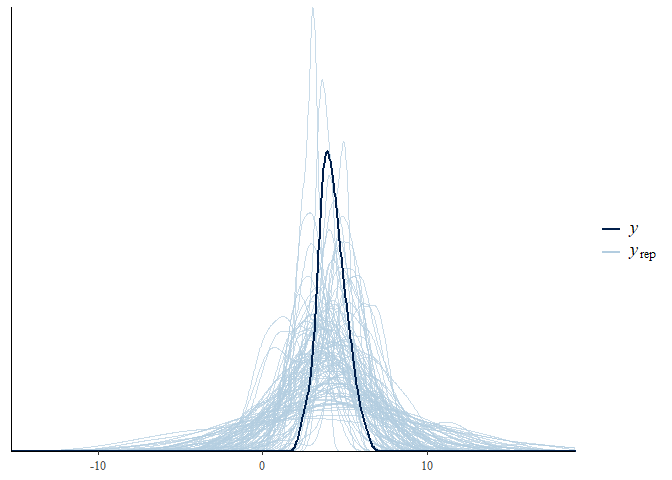

``` r
## Fitting the model
AltercentricM_m <- brm(
  formula = AltercentricM_f,
  data = d_scz,
  family = gaussian,
  prior = prior_M,
  sample_prior = T
)
```

    ## Compiling the C++ model
    ## Start sampling

    ## 
    ## SAMPLING FOR MODEL 'e5d6ebd0ee5ea48e04998306f0f6ddb8' NOW (CHAIN 1).
    ## Chain 1: 
    ## Chain 1: Gradient evaluation took 0 seconds
    ## Chain 1: 1000 transitions using 10 leapfrog steps per transition would take 0 seconds.
    ## Chain 1: Adjust your expectations accordingly!
    ## Chain 1: 
    ## Chain 1: 
    ## Chain 1: Iteration:    1 / 2000 [  0%]  (Warmup)
    ## Chain 1: Iteration:  200 / 2000 [ 10%]  (Warmup)
    ## Chain 1: Iteration:  400 / 2000 [ 20%]  (Warmup)
    ## Chain 1: Iteration:  600 / 2000 [ 30%]  (Warmup)
    ## Chain 1: Iteration:  800 / 2000 [ 40%]  (Warmup)
    ## Chain 1: Iteration: 1000 / 2000 [ 50%]  (Warmup)
    ## Chain 1: Iteration: 1001 / 2000 [ 50%]  (Sampling)
    ## Chain 1: Iteration: 1200 / 2000 [ 60%]  (Sampling)
    ## Chain 1: Iteration: 1400 / 2000 [ 70%]  (Sampling)
    ## Chain 1: Iteration: 1600 / 2000 [ 80%]  (Sampling)
    ## Chain 1: Iteration: 1800 / 2000 [ 90%]  (Sampling)
    ## Chain 1: Iteration: 2000 / 2000 [100%]  (Sampling)
    ## Chain 1: 
    ## Chain 1:  Elapsed Time: 0.05 seconds (Warm-up)
    ## Chain 1:                0.051 seconds (Sampling)
    ## Chain 1:                0.101 seconds (Total)
    ## Chain 1: 
    ## 
    ## SAMPLING FOR MODEL 'e5d6ebd0ee5ea48e04998306f0f6ddb8' NOW (CHAIN 2).
    ## Chain 2: 
    ## Chain 2: Gradient evaluation took 0 seconds
    ## Chain 2: 1000 transitions using 10 leapfrog steps per transition would take 0 seconds.
    ## Chain 2: Adjust your expectations accordingly!
    ## Chain 2: 
    ## Chain 2: 
    ## Chain 2: Iteration:    1 / 2000 [  0%]  (Warmup)
    ## Chain 2: Iteration:  200 / 2000 [ 10%]  (Warmup)
    ## Chain 2: Iteration:  400 / 2000 [ 20%]  (Warmup)
    ## Chain 2: Iteration:  600 / 2000 [ 30%]  (Warmup)
    ## Chain 2: Iteration:  800 / 2000 [ 40%]  (Warmup)
    ## Chain 2: Iteration: 1000 / 2000 [ 50%]  (Warmup)
    ## Chain 2: Iteration: 1001 / 2000 [ 50%]  (Sampling)
    ## Chain 2: Iteration: 1200 / 2000 [ 60%]  (Sampling)
    ## Chain 2: Iteration: 1400 / 2000 [ 70%]  (Sampling)
    ## Chain 2: Iteration: 1600 / 2000 [ 80%]  (Sampling)
    ## Chain 2: Iteration: 1800 / 2000 [ 90%]  (Sampling)
    ## Chain 2: Iteration: 2000 / 2000 [100%]  (Sampling)
    ## Chain 2: 
    ## Chain 2:  Elapsed Time: 0.053 seconds (Warm-up)
    ## Chain 2:                0.045 seconds (Sampling)
    ## Chain 2:                0.098 seconds (Total)
    ## Chain 2: 
    ## 
    ## SAMPLING FOR MODEL 'e5d6ebd0ee5ea48e04998306f0f6ddb8' NOW (CHAIN 3).
    ## Chain 3: 
    ## Chain 3: Gradient evaluation took 0 seconds
    ## Chain 3: 1000 transitions using 10 leapfrog steps per transition would take 0 seconds.
    ## Chain 3: Adjust your expectations accordingly!
    ## Chain 3: 
    ## Chain 3: 
    ## Chain 3: Iteration:    1 / 2000 [  0%]  (Warmup)
    ## Chain 3: Iteration:  200 / 2000 [ 10%]  (Warmup)
    ## Chain 3: Iteration:  400 / 2000 [ 20%]  (Warmup)
    ## Chain 3: Iteration:  600 / 2000 [ 30%]  (Warmup)
    ## Chain 3: Iteration:  800 / 2000 [ 40%]  (Warmup)
    ## Chain 3: Iteration: 1000 / 2000 [ 50%]  (Warmup)
    ## Chain 3: Iteration: 1001 / 2000 [ 50%]  (Sampling)
    ## Chain 3: Iteration: 1200 / 2000 [ 60%]  (Sampling)
    ## Chain 3: Iteration: 1400 / 2000 [ 70%]  (Sampling)
    ## Chain 3: Iteration: 1600 / 2000 [ 80%]  (Sampling)
    ## Chain 3: Iteration: 1800 / 2000 [ 90%]  (Sampling)
    ## Chain 3: Iteration: 2000 / 2000 [100%]  (Sampling)
    ## Chain 3: 
    ## Chain 3:  Elapsed Time: 0.054 seconds (Warm-up)
    ## Chain 3:                0.064 seconds (Sampling)
    ## Chain 3:                0.118 seconds (Total)
    ## Chain 3: 
    ## 
    ## SAMPLING FOR MODEL 'e5d6ebd0ee5ea48e04998306f0f6ddb8' NOW (CHAIN 4).
    ## Chain 4: 
    ## Chain 4: Gradient evaluation took 0 seconds
    ## Chain 4: 1000 transitions using 10 leapfrog steps per transition would take 0 seconds.
    ## Chain 4: Adjust your expectations accordingly!
    ## Chain 4: 
    ## Chain 4: 
    ## Chain 4: Iteration:    1 / 2000 [  0%]  (Warmup)
    ## Chain 4: Iteration:  200 / 2000 [ 10%]  (Warmup)
    ## Chain 4: Iteration:  400 / 2000 [ 20%]  (Warmup)
    ## Chain 4: Iteration:  600 / 2000 [ 30%]  (Warmup)
    ## Chain 4: Iteration:  800 / 2000 [ 40%]  (Warmup)
    ## Chain 4: Iteration: 1000 / 2000 [ 50%]  (Warmup)
    ## Chain 4: Iteration: 1001 / 2000 [ 50%]  (Sampling)
    ## Chain 4: Iteration: 1200 / 2000 [ 60%]  (Sampling)
    ## Chain 4: Iteration: 1400 / 2000 [ 70%]  (Sampling)
    ## Chain 4: Iteration: 1600 / 2000 [ 80%]  (Sampling)
    ## Chain 4: Iteration: 1800 / 2000 [ 90%]  (Sampling)
    ## Chain 4: Iteration: 2000 / 2000 [100%]  (Sampling)
    ## Chain 4: 
    ## Chain 4:  Elapsed Time: 0.061 seconds (Warm-up)
    ## Chain 4:                0.049 seconds (Sampling)
    ## Chain 4:                0.11 seconds (Total)
    ## Chain 4:

``` r
# Posterior predictive check
pp_check(AltercentricM_m, nsamples = 100)
```

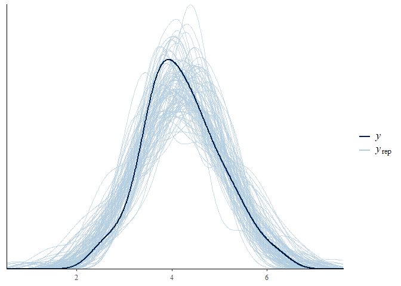

``` r
# Model
AltercentricM_m
```

    ##  Family: gaussian 
    ##   Links: mu = identity; sigma = identity 
    ## Formula: AltercentricIntrusion ~ 1 + VoiceHearing + MindReading + Apathy 
    ##    Data: d_scz (Number of observations: 75) 
    ## Samples: 4 chains, each with iter = 2000; warmup = 1000; thin = 1;
    ##          total post-warmup samples = 4000
    ## 
    ## Population-Level Effects: 
    ##              Estimate Est.Error l-95% CI u-95% CI Rhat Bulk_ESS Tail_ESS
    ## Intercept        4.22      0.09     4.04     4.41 1.00     4282     2616
    ## VoiceHearing     0.05      0.15    -0.25     0.35 1.00     3274     2741
    ## MindReading      0.03      0.14    -0.24     0.30 1.00     3345     2982
    ## Apathy          -0.22      0.16    -0.52     0.10 1.00     3537     3275
    ## 
    ## Family Specific Parameters: 
    ##       Estimate Est.Error l-95% CI u-95% CI Rhat Bulk_ESS Tail_ESS
    ## sigma     0.83      0.07     0.71     0.98 1.00     3865     2655
    ## 
    ## Samples were drawn using sampling(NUTS). For each parameter, Bulk_ESS
    ## and Tail_ESS are effective sample size measures, and Rhat is the potential
    ## scale reduction factor on split chains (at convergence, Rhat = 1).

``` r
# Plot
conditional_effects(AltercentricM_m)
```

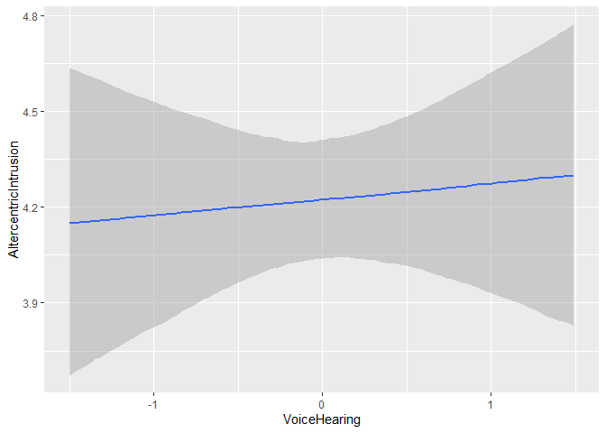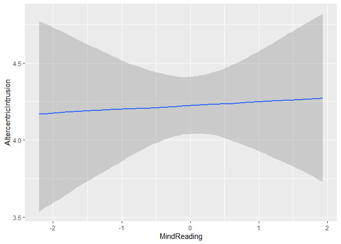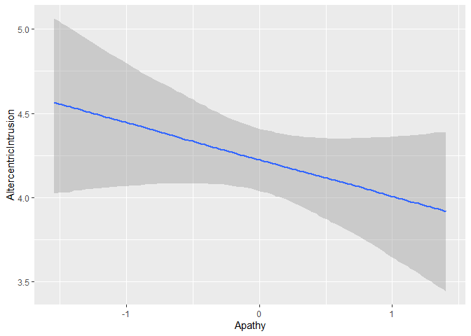

``` r
stanplot(AltercentricM_m)
```

    ## Warning: Method 'stanplot' is deprecated. Please use 'mcmc_plot' instead.

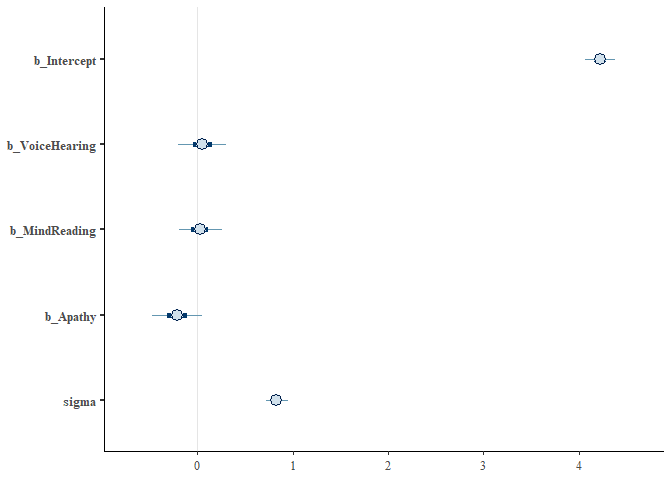

Second part
-----------

Q2.1) However, we know that the diagnosis is based on symptom assessment: if the overall sum of symptoms is severe enough, the participant gets a diagnosis. In other words, by selecting the patients, and including the symptoms in the model we might have inadvertently introduced an issue in our inference. Do try to draw a causal graph (Directed Acyclical Graph) of the variables and compare it with the types of causal graphs presented in the slides. Discuss which biases you might have introduced.

Q2.2.) Redesign your analysis following the graph and report how the results change

``` r
# Prior check

AltercentricM_PriorCheck_m <- brm(
  formula = AltercentricM_f,
  data = d,
  family = gaussian,
  prior = prior_M,
  sample_prior = "only"
)
```

    ## Compiling the C++ model

    ## recompiling to avoid crashing R session

    ## Start sampling

    ## 
    ## SAMPLING FOR MODEL '4b616f6dce6155a61a541e2ba50d54b3' NOW (CHAIN 1).
    ## Chain 1: 
    ## Chain 1: Gradient evaluation took 0 seconds
    ## Chain 1: 1000 transitions using 10 leapfrog steps per transition would take 0 seconds.
    ## Chain 1: Adjust your expectations accordingly!
    ## Chain 1: 
    ## Chain 1: 
    ## Chain 1: Iteration:    1 / 2000 [  0%]  (Warmup)
    ## Chain 1: Iteration:  200 / 2000 [ 10%]  (Warmup)
    ## Chain 1: Iteration:  400 / 2000 [ 20%]  (Warmup)
    ## Chain 1: Iteration:  600 / 2000 [ 30%]  (Warmup)
    ## Chain 1: Iteration:  800 / 2000 [ 40%]  (Warmup)
    ## Chain 1: Iteration: 1000 / 2000 [ 50%]  (Warmup)
    ## Chain 1: Iteration: 1001 / 2000 [ 50%]  (Sampling)
    ## Chain 1: Iteration: 1200 / 2000 [ 60%]  (Sampling)
    ## Chain 1: Iteration: 1400 / 2000 [ 70%]  (Sampling)
    ## Chain 1: Iteration: 1600 / 2000 [ 80%]  (Sampling)
    ## Chain 1: Iteration: 1800 / 2000 [ 90%]  (Sampling)
    ## Chain 1: Iteration: 2000 / 2000 [100%]  (Sampling)
    ## Chain 1: 
    ## Chain 1:  Elapsed Time: 0.036 seconds (Warm-up)
    ## Chain 1:                0.037 seconds (Sampling)
    ## Chain 1:                0.073 seconds (Total)
    ## Chain 1: 
    ## 
    ## SAMPLING FOR MODEL '4b616f6dce6155a61a541e2ba50d54b3' NOW (CHAIN 2).
    ## Chain 2: 
    ## Chain 2: Gradient evaluation took 0 seconds
    ## Chain 2: 1000 transitions using 10 leapfrog steps per transition would take 0 seconds.
    ## Chain 2: Adjust your expectations accordingly!
    ## Chain 2: 
    ## Chain 2: 
    ## Chain 2: Iteration:    1 / 2000 [  0%]  (Warmup)
    ## Chain 2: Iteration:  200 / 2000 [ 10%]  (Warmup)
    ## Chain 2: Iteration:  400 / 2000 [ 20%]  (Warmup)
    ## Chain 2: Iteration:  600 / 2000 [ 30%]  (Warmup)
    ## Chain 2: Iteration:  800 / 2000 [ 40%]  (Warmup)
    ## Chain 2: Iteration: 1000 / 2000 [ 50%]  (Warmup)
    ## Chain 2: Iteration: 1001 / 2000 [ 50%]  (Sampling)
    ## Chain 2: Iteration: 1200 / 2000 [ 60%]  (Sampling)
    ## Chain 2: Iteration: 1400 / 2000 [ 70%]  (Sampling)
    ## Chain 2: Iteration: 1600 / 2000 [ 80%]  (Sampling)
    ## Chain 2: Iteration: 1800 / 2000 [ 90%]  (Sampling)
    ## Chain 2: Iteration: 2000 / 2000 [100%]  (Sampling)
    ## Chain 2: 
    ## Chain 2:  Elapsed Time: 0.038 seconds (Warm-up)
    ## Chain 2:                0.037 seconds (Sampling)
    ## Chain 2:                0.075 seconds (Total)
    ## Chain 2: 
    ## 
    ## SAMPLING FOR MODEL '4b616f6dce6155a61a541e2ba50d54b3' NOW (CHAIN 3).
    ## Chain 3: 
    ## Chain 3: Gradient evaluation took 0 seconds
    ## Chain 3: 1000 transitions using 10 leapfrog steps per transition would take 0 seconds.
    ## Chain 3: Adjust your expectations accordingly!
    ## Chain 3: 
    ## Chain 3: 
    ## Chain 3: Iteration:    1 / 2000 [  0%]  (Warmup)
    ## Chain 3: Iteration:  200 / 2000 [ 10%]  (Warmup)
    ## Chain 3: Iteration:  400 / 2000 [ 20%]  (Warmup)
    ## Chain 3: Iteration:  600 / 2000 [ 30%]  (Warmup)
    ## Chain 3: Iteration:  800 / 2000 [ 40%]  (Warmup)
    ## Chain 3: Iteration: 1000 / 2000 [ 50%]  (Warmup)
    ## Chain 3: Iteration: 1001 / 2000 [ 50%]  (Sampling)
    ## Chain 3: Iteration: 1200 / 2000 [ 60%]  (Sampling)
    ## Chain 3: Iteration: 1400 / 2000 [ 70%]  (Sampling)
    ## Chain 3: Iteration: 1600 / 2000 [ 80%]  (Sampling)
    ## Chain 3: Iteration: 1800 / 2000 [ 90%]  (Sampling)
    ## Chain 3: Iteration: 2000 / 2000 [100%]  (Sampling)
    ## Chain 3: 
    ## Chain 3:  Elapsed Time: 0.037 seconds (Warm-up)
    ## Chain 3:                0.036 seconds (Sampling)
    ## Chain 3:                0.073 seconds (Total)
    ## Chain 3: 
    ## 
    ## SAMPLING FOR MODEL '4b616f6dce6155a61a541e2ba50d54b3' NOW (CHAIN 4).
    ## Chain 4: 
    ## Chain 4: Gradient evaluation took 0 seconds
    ## Chain 4: 1000 transitions using 10 leapfrog steps per transition would take 0 seconds.
    ## Chain 4: Adjust your expectations accordingly!
    ## Chain 4: 
    ## Chain 4: 
    ## Chain 4: Iteration:    1 / 2000 [  0%]  (Warmup)
    ## Chain 4: Iteration:  200 / 2000 [ 10%]  (Warmup)
    ## Chain 4: Iteration:  400 / 2000 [ 20%]  (Warmup)
    ## Chain 4: Iteration:  600 / 2000 [ 30%]  (Warmup)
    ## Chain 4: Iteration:  800 / 2000 [ 40%]  (Warmup)
    ## Chain 4: Iteration: 1000 / 2000 [ 50%]  (Warmup)
    ## Chain 4: Iteration: 1001 / 2000 [ 50%]  (Sampling)
    ## Chain 4: Iteration: 1200 / 2000 [ 60%]  (Sampling)
    ## Chain 4: Iteration: 1400 / 2000 [ 70%]  (Sampling)
    ## Chain 4: Iteration: 1600 / 2000 [ 80%]  (Sampling)
    ## Chain 4: Iteration: 1800 / 2000 [ 90%]  (Sampling)
    ## Chain 4: Iteration: 2000 / 2000 [100%]  (Sampling)
    ## Chain 4: 
    ## Chain 4:  Elapsed Time: 0.041 seconds (Warm-up)
    ## Chain 4:                0.061 seconds (Sampling)
    ## Chain 4:                0.102 seconds (Total)
    ## Chain 4:

``` r
pp_check(AltercentricM_PriorCheck_m, nsamples = 100)
```

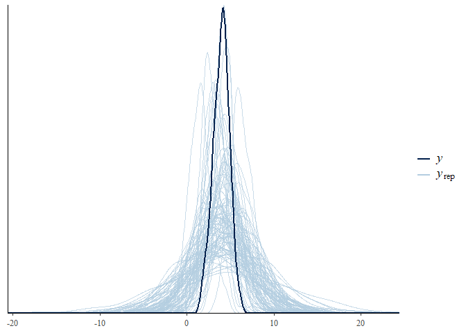

``` r
## Fitting the model
AltercentricM_m <- brm(
  formula = AltercentricM_f,
  data = d,
  family = gaussian,
  prior = prior_M,
  sample_prior = T
)
```

    ## Compiling the C++ model

    ## recompiling to avoid crashing R session

    ## Start sampling

    ## 
    ## SAMPLING FOR MODEL 'e5d6ebd0ee5ea48e04998306f0f6ddb8' NOW (CHAIN 1).
    ## Chain 1: 
    ## Chain 1: Gradient evaluation took 0 seconds
    ## Chain 1: 1000 transitions using 10 leapfrog steps per transition would take 0 seconds.
    ## Chain 1: Adjust your expectations accordingly!
    ## Chain 1: 
    ## Chain 1: 
    ## Chain 1: Iteration:    1 / 2000 [  0%]  (Warmup)
    ## Chain 1: Iteration:  200 / 2000 [ 10%]  (Warmup)
    ## Chain 1: Iteration:  400 / 2000 [ 20%]  (Warmup)
    ## Chain 1: Iteration:  600 / 2000 [ 30%]  (Warmup)
    ## Chain 1: Iteration:  800 / 2000 [ 40%]  (Warmup)
    ## Chain 1: Iteration: 1000 / 2000 [ 50%]  (Warmup)
    ## Chain 1: Iteration: 1001 / 2000 [ 50%]  (Sampling)
    ## Chain 1: Iteration: 1200 / 2000 [ 60%]  (Sampling)
    ## Chain 1: Iteration: 1400 / 2000 [ 70%]  (Sampling)
    ## Chain 1: Iteration: 1600 / 2000 [ 80%]  (Sampling)
    ## Chain 1: Iteration: 1800 / 2000 [ 90%]  (Sampling)
    ## Chain 1: Iteration: 2000 / 2000 [100%]  (Sampling)
    ## Chain 1: 
    ## Chain 1:  Elapsed Time: 0.056 seconds (Warm-up)
    ## Chain 1:                0.056 seconds (Sampling)
    ## Chain 1:                0.112 seconds (Total)
    ## Chain 1: 
    ## 
    ## SAMPLING FOR MODEL 'e5d6ebd0ee5ea48e04998306f0f6ddb8' NOW (CHAIN 2).
    ## Chain 2: 
    ## Chain 2: Gradient evaluation took 0 seconds
    ## Chain 2: 1000 transitions using 10 leapfrog steps per transition would take 0 seconds.
    ## Chain 2: Adjust your expectations accordingly!
    ## Chain 2: 
    ## Chain 2: 
    ## Chain 2: Iteration:    1 / 2000 [  0%]  (Warmup)
    ## Chain 2: Iteration:  200 / 2000 [ 10%]  (Warmup)
    ## Chain 2: Iteration:  400 / 2000 [ 20%]  (Warmup)
    ## Chain 2: Iteration:  600 / 2000 [ 30%]  (Warmup)
    ## Chain 2: Iteration:  800 / 2000 [ 40%]  (Warmup)
    ## Chain 2: Iteration: 1000 / 2000 [ 50%]  (Warmup)
    ## Chain 2: Iteration: 1001 / 2000 [ 50%]  (Sampling)
    ## Chain 2: Iteration: 1200 / 2000 [ 60%]  (Sampling)
    ## Chain 2: Iteration: 1400 / 2000 [ 70%]  (Sampling)
    ## Chain 2: Iteration: 1600 / 2000 [ 80%]  (Sampling)
    ## Chain 2: Iteration: 1800 / 2000 [ 90%]  (Sampling)
    ## Chain 2: Iteration: 2000 / 2000 [100%]  (Sampling)
    ## Chain 2: 
    ## Chain 2:  Elapsed Time: 0.053 seconds (Warm-up)
    ## Chain 2:                0.058 seconds (Sampling)
    ## Chain 2:                0.111 seconds (Total)
    ## Chain 2: 
    ## 
    ## SAMPLING FOR MODEL 'e5d6ebd0ee5ea48e04998306f0f6ddb8' NOW (CHAIN 3).
    ## Chain 3: 
    ## Chain 3: Gradient evaluation took 0 seconds
    ## Chain 3: 1000 transitions using 10 leapfrog steps per transition would take 0 seconds.
    ## Chain 3: Adjust your expectations accordingly!
    ## Chain 3: 
    ## Chain 3: 
    ## Chain 3: Iteration:    1 / 2000 [  0%]  (Warmup)
    ## Chain 3: Iteration:  200 / 2000 [ 10%]  (Warmup)
    ## Chain 3: Iteration:  400 / 2000 [ 20%]  (Warmup)
    ## Chain 3: Iteration:  600 / 2000 [ 30%]  (Warmup)
    ## Chain 3: Iteration:  800 / 2000 [ 40%]  (Warmup)
    ## Chain 3: Iteration: 1000 / 2000 [ 50%]  (Warmup)
    ## Chain 3: Iteration: 1001 / 2000 [ 50%]  (Sampling)
    ## Chain 3: Iteration: 1200 / 2000 [ 60%]  (Sampling)
    ## Chain 3: Iteration: 1400 / 2000 [ 70%]  (Sampling)
    ## Chain 3: Iteration: 1600 / 2000 [ 80%]  (Sampling)
    ## Chain 3: Iteration: 1800 / 2000 [ 90%]  (Sampling)
    ## Chain 3: Iteration: 2000 / 2000 [100%]  (Sampling)
    ## Chain 3: 
    ## Chain 3:  Elapsed Time: 0.051 seconds (Warm-up)
    ## Chain 3:                0.06 seconds (Sampling)
    ## Chain 3:                0.111 seconds (Total)
    ## Chain 3: 
    ## 
    ## SAMPLING FOR MODEL 'e5d6ebd0ee5ea48e04998306f0f6ddb8' NOW (CHAIN 4).
    ## Chain 4: 
    ## Chain 4: Gradient evaluation took 0 seconds
    ## Chain 4: 1000 transitions using 10 leapfrog steps per transition would take 0 seconds.
    ## Chain 4: Adjust your expectations accordingly!
    ## Chain 4: 
    ## Chain 4: 
    ## Chain 4: Iteration:    1 / 2000 [  0%]  (Warmup)
    ## Chain 4: Iteration:  200 / 2000 [ 10%]  (Warmup)
    ## Chain 4: Iteration:  400 / 2000 [ 20%]  (Warmup)
    ## Chain 4: Iteration:  600 / 2000 [ 30%]  (Warmup)
    ## Chain 4: Iteration:  800 / 2000 [ 40%]  (Warmup)
    ## Chain 4: Iteration: 1000 / 2000 [ 50%]  (Warmup)
    ## Chain 4: Iteration: 1001 / 2000 [ 50%]  (Sampling)
    ## Chain 4: Iteration: 1200 / 2000 [ 60%]  (Sampling)
    ## Chain 4: Iteration: 1400 / 2000 [ 70%]  (Sampling)
    ## Chain 4: Iteration: 1600 / 2000 [ 80%]  (Sampling)
    ## Chain 4: Iteration: 1800 / 2000 [ 90%]  (Sampling)
    ## Chain 4: Iteration: 2000 / 2000 [100%]  (Sampling)
    ## Chain 4: 
    ## Chain 4:  Elapsed Time: 0.054 seconds (Warm-up)
    ## Chain 4:                0.058 seconds (Sampling)
    ## Chain 4:                0.112 seconds (Total)
    ## Chain 4:

``` r
# Posterior predictive check
pp_check(AltercentricM_m, nsamples = 100)
```

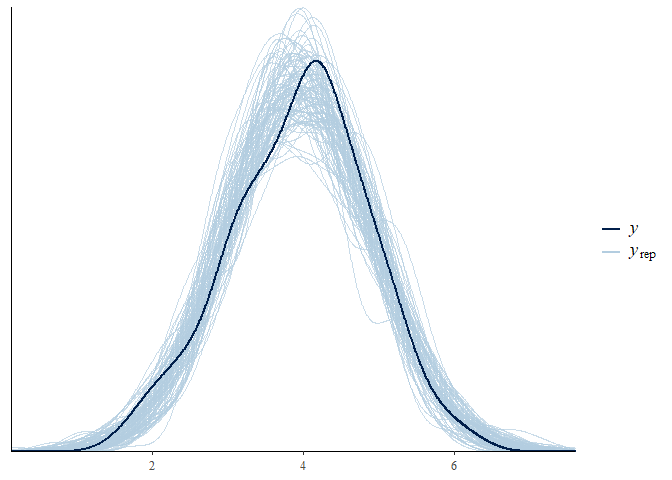

``` r
# Model
AltercentricM_m
```

    ##  Family: gaussian 
    ##   Links: mu = identity; sigma = identity 
    ## Formula: AltercentricIntrusion ~ 1 + VoiceHearing + MindReading + Apathy 
    ##    Data: d (Number of observations: 300) 
    ## Samples: 4 chains, each with iter = 2000; warmup = 1000; thin = 1;
    ##          total post-warmup samples = 4000
    ## 
    ## Population-Level Effects: 
    ##              Estimate Est.Error l-95% CI u-95% CI Rhat Bulk_ESS Tail_ESS
    ## Intercept        3.95      0.05     3.85     4.05 1.00     4972     3152
    ## VoiceHearing     0.15      0.05     0.05     0.25 1.00     4052     3081
    ## MindReading      0.16      0.05     0.05     0.27 1.00     5311     2815
    ## Apathy           0.01      0.06    -0.10     0.12 1.00     4667     3235
    ## 
    ## Family Specific Parameters: 
    ##       Estimate Est.Error l-95% CI u-95% CI Rhat Bulk_ESS Tail_ESS
    ## sigma     0.90      0.04     0.83     0.98 1.00     4258     2917
    ## 
    ## Samples were drawn using sampling(NUTS). For each parameter, Bulk_ESS
    ## and Tail_ESS are effective sample size measures, and Rhat is the potential
    ## scale reduction factor on split chains (at convergence, Rhat = 1).

``` r
# Plot
conditional_effects(AltercentricM_m)
```

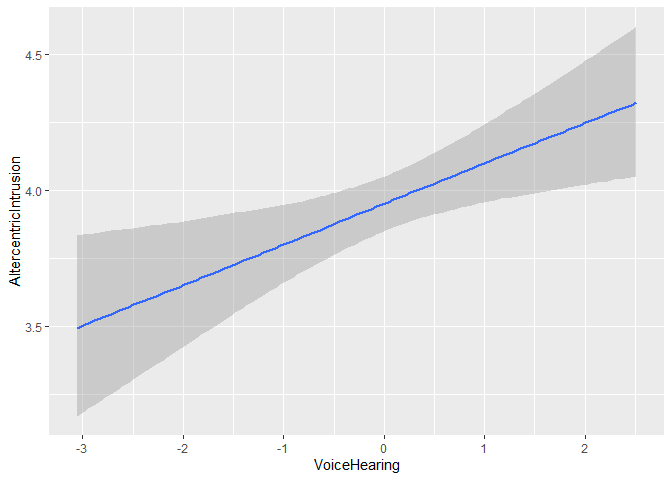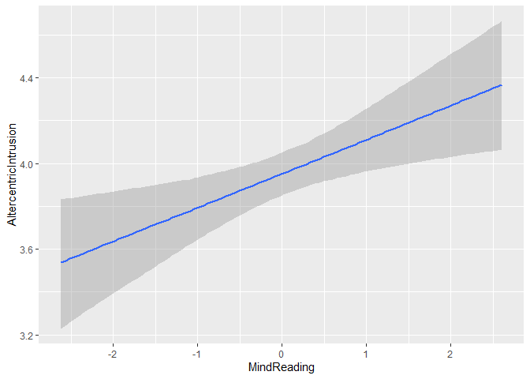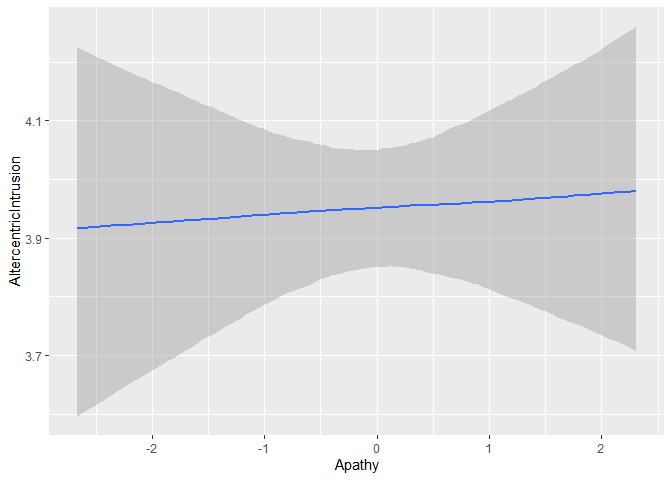

``` r
stanplot(AltercentricM_m)
```

    ## Warning: Method 'stanplot' is deprecated. Please use 'mcmc_plot' instead.

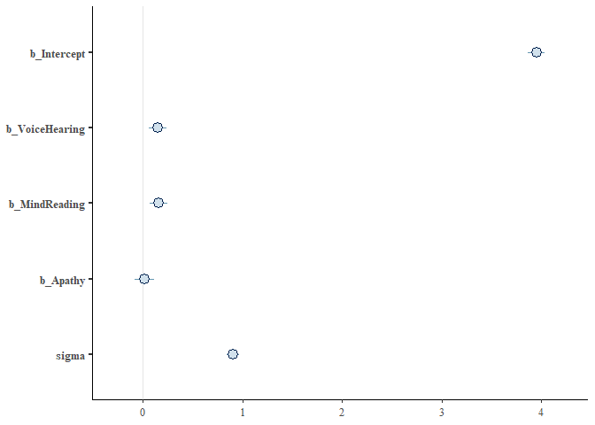

Third part
----------

These issues are very difficult to think through, and not knowing the causal mechanisms generating the data in advance makes our inferences even more unreliable. To explore these issues, I recommend using simulations. In other words, defining a "true" model, generating data from it and assessing what different analyses would lead you to infer (and therefore which biases they might introduce). You can find the code I used to simulate your data below.

Q3.1) Look through the code and identify whether the results you have match the underlying truth. Discuss what you have learned.

Q3.2) OPTIONAL: is this a general pattern? Try varying the parameters (e.g. correlation values) and assess whether the new dataset(s) leads to the same biases in your analysis.

``` r
pacman::p_load(MASS, tidyverse, psych)

seed <- 1981 # Defining a seed so the results are always the same
n <- 300 # Defining the amount of participants

SymptomCorr <- .2 # Defining the correlation of symptoms (as they tend to co-occur)
EffectCorrRel <- .2 # Defining the correlation between relevant symptoms and effect (Some symptoms are positively correlated with the effect)
EffectCorrIrrel <- 0 # Defining the correlation between irrelevant symptoms and effect (none)

# Creating the variance-covariance matrix for the variables we want to generate (3 symptoms, 1 effect)
Sigma <- matrix(data=c(1,SymptomCorr,SymptomCorr,EffectCorrRel,
                       SymptomCorr,1,SymptomCorr,EffectCorrRel,
                       SymptomCorr,SymptomCorr,1,EffectCorrIrrel,
                       EffectCorrRel,EffectCorrRel,EffectCorrIrrel,1),
                       nrow=4,ncol=4)

## Generate data from a multivariate (mvr) normal (n) distribution
d <- mvrnorm(n = n, # number of participant
        mu = c(1.2, 1.2, 1.2, 4), # mean of each variable
        Sigma) # variance co-variance matrix

# Giving meaningful names to variables and add ID
d <- data.frame(
  VoiceHearing = d[,1], 
  MindReading =  d[,2],
  Apathy =  d[,3], 
  AltercentricIntrusion = d[,4],
  ID = seq(nrow(d)))

# Assessing whether the participant has schizophrenia (high enough sum of symptoms)
# Here we choose participants scoring above 75% percentile (the most severe ones)
d$Diagnosis <- 0
d$Diagnosis[(d$VoiceHearing + d$MindReading + d$Apathy) > 
              quantile(d$VoiceHearing + d$MindReading + d$Apathy, .75)] <-1

## Plotting the relation between variables in schizophrenia
d1 <- d %>% subset(Diagnosis==1) %>% dplyr::select(-Diagnosis, -ID)
pairs.panels(d1)
```

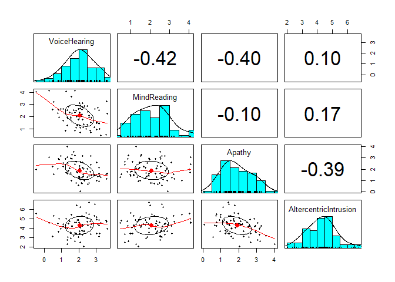

``` r
## Plotting the relation between variables all participants
pairs.panels(dplyr::select(d,-Diagnosis, -ID))
```

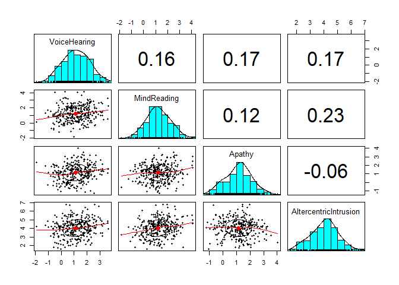

``` r
#write_csv(d, "data/Ass3.csv")
```
